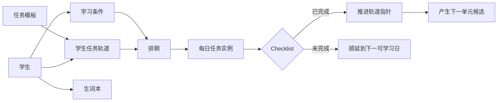
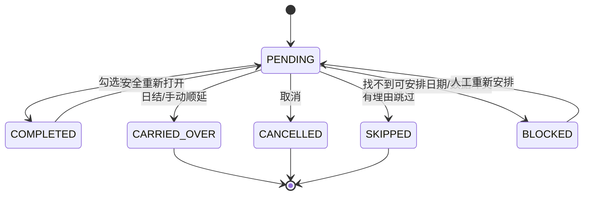
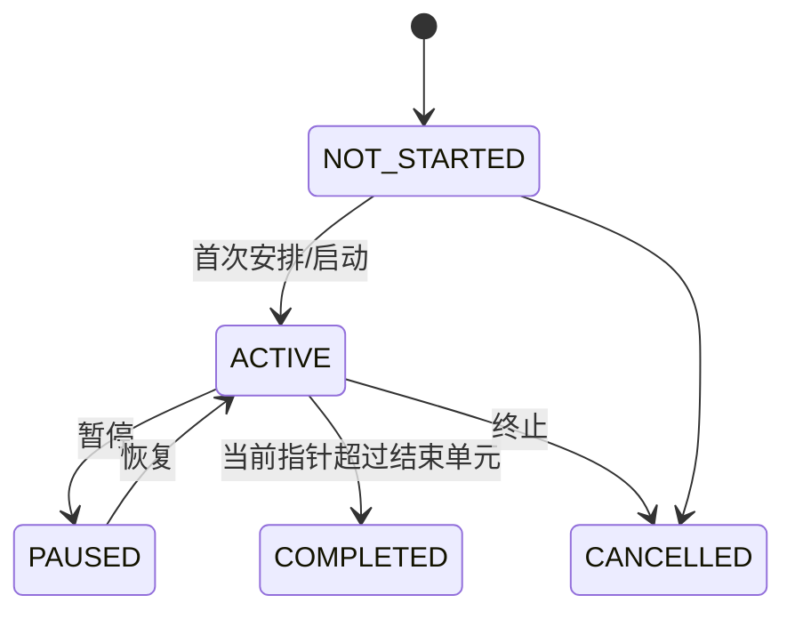

# 助教工作台需求规格与竞品研究（PRD）

> 文档版本：v1.0  
> 文档状态：可进入技术设计与原型阶段  
> 编制日期：2026-08-16  
> 适用范围：问道教育助教工作台（仅覆盖助教排期、任务推进与生词本，不覆盖刷题系统、题目录入、阅卷与完整学生端）

---

## 0. 文档控制

### 0.1 文档目的

本文件用于冻结助教工作台的产品边界、业务对象、交互规则和验收标准，并将客户会议、现行 Excel 工作方式与行业产品经验统一为可实施的需求基线。后续《开发设计文档》和《实施任务与测试计划》均以本文件中的需求编号为追溯源。

### 0.2 需求来源

1. 客户会议逐字稿：《[问道教育]Brenda老师的个人会议室 - 逐字稿》，重点包括助教每日重复布置作业、每名学生时间与设备条件不同、任务未完成顺延、完成后自动进入下一节、生词本按学生归档等内容。
2. 现行任务表：《强化班课前预习任务(1).xlsx》。其中“作业进度目录”以列表示长期任务类别，以行表示连续任务单元，包含阅读词汇 30 单元、一天一句长难句 30 单元、机经词汇示例 30 单元、807 词汇 26 单元、写作观点剖析 27 单元、口语 Part3 素材课 74 单元、写作词伙 25 个有效非空单元（原表另有 1 个仅包含空格的单元，导入时应按空值处理）。
3. 用户在本轮沟通中确认的交互：顶部导航；首页为“今日工作”；全局搜索；学生工作台采用紧凑/扩展密度；姓名点击资料；“生词本”和“排期”为独立按钮；固定模板可拖拽，个性化任务优先表格式写入；单学生日/周/月视图；Checklist 勾选驱动进度，未勾选自动顺延。
4. 外部研究：个人待办、团队协作、资源排期、工单与现场服务、教育管理和开源项目管理产品。

### 0.3 术语

| 术语 | 定义 |
|---|---|
| 学生 Student | 工作台的一级业务对象。任务、排期、学习条件、生词均必须归属于学生。 |
| 任务模板 Task Template | 一类长期、可重复挂载的学习任务，例如“807词汇”或“密卷”。 |
| 模板版本 Template Version | 某任务模板在一个时间点发布的稳定结构，防止教研修改污染历史记录。 |
| 模板单元 Template Item | 模板中的一个顺序单元，例如“807第12节”。 |
| 学生任务轨道 Student Task Track | 将某个模板挂载到某名学生后的长期进度实例，例如“Monica 的 807：12/26”。 |
| 每日任务 Task Instance | 某学生在某个业务日期需要执行的一项具体任务。 |
| 临时任务 Ad-hoc Task | 不属于连续模板轨道、完成后不产生下一单元的个性化任务。 |
| 顺延 Carry-over | 当日未完成任务转移到学生下一个符合条件的可学习日期，并保留完整历史链。 |
| 今日工作 Today Workspace | 助教每天进入系统后的默认执行页面。 |
| 学生工作台 Student Workbench | 以学生为纵轴、日期为横轴的多学生排期与执行界面。 |
| 排期按钮 Schedule Button | 学生身份区的独立入口，进入该学生的日/周/月排期页面。 |
| 生词本按钮 Vocabulary Button | 学生身份区的独立入口，进入该学生的生词本。 |

---

# 1. 产品定义

## 1.1 一句话定义

助教工作台是一套**以学生为核心、以时间为横轴、以连续任务轨道为进度来源、以 Checklist 为执行入口、以自动顺延为减负机制**的学习任务调度系统。

## 1.2 不是哪些产品

本系统不是：

- 将现有 Excel 原样网页化；
- 面向个人使用的普通 To-do List；
- 只管理课程预约、收费和考勤的教培 SaaS；
- 以项目和员工为中心的通用项目管理系统；
- 依赖大模型自由生成所有学习计划的 AI 排课器；
- 在一个巨大“任务池”中要求助教拖动几百条任务的看板。

## 1.3 核心价值链



## 1.4 成功标准

上线后应达到以下可观测目标：

1. 助教主要操作从“查表—复制—组合—再复制”转为“查看—勾选—少量调整”。
2. 每名学生的任务轨道、每日任务、完成历史和生词形成可追溯链路。
3. 固定任务通过轨道自动推进，个性化任务可像表格一样快速录入。
4. 未完成任务不丢失、不跳号，自动顺延过程对老师可见且可撤销。
5. 在常见 20—60 名学生规模下，教师可以在一个屏幕内快速扫描未来一周安排。
6. 任务搜索可以反向回答“这项任务分配给了哪些学生、分别在哪一天、当前进度如何”。

---

# 2. 外部产品研究

## 2.1 研究方法

本轮研究以官方产品文档、官方帮助中心和官方开源仓库为主要证据，覆盖 **31 个具名产品、项目或解决方案线**，重点比较七类产品：

1. 个人待办与 Checklist；
2. 团队任务与项目管理；
3. 资源排期与工作负载；
4. 工单、现场服务与预防性维护；
5. 金融/商业案件管理、活动队列与人工/自动任务；
6. 教培、辅导与学生管理；
7. 可自托管的开源任务/内部工具平台。

研究不以“哪个产品与本项目最像”为唯一目标，而是拆解各行业已经验证的局部机制，再组合为适合助教业务的产品模型。样本数量用于说明覆盖面，不代表所有产品都与本项目同类；真正采用的是经过业务模型校验的局部模式。

## 2.2 个人待办产品：借鉴最低操作成本

| 产品 | 已验证模式 | 本项目可借鉴内容 | 不直接照搬的部分 |
|---|---|---|---|
| TickTick 滴答清单 | Today、日/周/月历、复选框、拖动改期、批量延后、重复任务 | 今日工作作为默认入口；复选框即执行动作；拖动只改变日期；月视图控制信息密度 | 个人任务缺少“学生—轨道—机构”层级，不能直接作为数据模型 |
| Todoist | Today/Upcoming、自然语言日期、重复日期、过滤器、日周月日历 | 全局日期搜索；今天/未来视图；延期与重复规则分离；过滤器组合 | “完成重复任务后生成下一次”不足以表达学生学习进度和模板版本 |
| Microsoft To Do / Things 等 | 简洁清单、今日聚焦、快速录入 | 快速添加、键盘优先、减少弹窗 | 通常不支持多人资源调度和可配置业务约束 |
| Sunsama / Akiflow / Motion | 日程与任务融合、时间块、容量意识 | 可学习分钟与预计任务分钟的容量提示 | 不应在 MVP 中引入复杂自动优化算法 |

主要官方参考：

- TickTick Calendar Workflows Guide：https://ticktick.com/resources/article/7340680464711024640/calendar-workflows-guide
- TickTick Recurring Tasks：https://help.ticktick.com/articles/7055782206349770752
- Todoist Today View：https://www.todoist.com/help/articles/plan-your-day-with-the-today-view-UVUXaiSs
- Todoist Recurring Dates：https://www.todoist.com/help/articles/introduction-to-recurring-dates-YUYVJJAV
- Todoist Calendar Layout：https://www.todoist.com/help/articles/use-the-calendar-layout-in-todoist-lPHRQTu0o

### 2.2.1 结论

个人待办产品最值得复制的是**交互简洁度**，不是其数据结构。本项目应让助教学会四个动作：勾、拖、写、挂；不应要求助教理解项目、Epic、Sprint 等通用项目管理概念。

## 2.3 团队项目与资源排期：借鉴“对象 × 时间”

| 产品 | 已验证模式 | 本项目转化 |
|---|---|---|
| Asana Timeline / Workload | 未排期项拖入时间轴；对象工作负载；批量移动；依赖关系 | 学生作为资源行；任务实例沿日期移动；后续可显示每日预计分钟与容量 |
| monday.com Workload / Gantt | 资源纵轴、时间横轴、容量单位、弹窗编辑 | 学生工作台的紧凑/扩展密度；任务卡详情抽屉；颜色表达状态而非装饰 |
| Airtable Timeline | Swimlane 之间拖动会改变归属；记录详情弹窗；未排期侧栏 | 固定模板可从快速添加区挂载；点击任务打开详情；但禁止把完整任务库常驻右侧 |
| Smartsheet Resource Management | 人员行、日周月缩放、搜索与能力过滤 | 多学生周排期；设备与学科标签作为筛选条件 |
| Linear | 键盘优先、快速搜索、活动历史、批量编辑 | 全局命令/搜索、快捷录入、操作日志 |

主要官方参考：

- Asana Timeline：https://help.asana.com/s/article/timeline
- Asana Workload：https://help.asana.com/s/article/portfolio-workload-and-universal-workload
- monday.com Workload：https://support.monday.com/hc/en-us/articles/360010166559-Resource-management-with-Workload
- Airtable Timeline Records：https://support.airtable.com/articles/9479809154-working-with-records-in-the-timeline-view
- Smartsheet Schedule：https://help.smartsheet.com/learning-track/resource-management-project-management/navigating-schedule

### 2.3.1 结论

“学生列表”和“学生排期”不应被拆成两个完全独立的后台页面。多学生工作区应采用学生为固定首列、日期为横轴，并通过紧凑/扩展密度切换同一份数据。月视图则只适用于单个学生，避免 30 名学生 × 30 天造成不可读矩阵。

## 2.4 工单与现场服务：借鉴实体分层和状态机

| 产品/类别 | 已验证模式 | 本项目转化 |
|---|---|---|
| Microsoft Dynamics 365 Field Service | Work Order、Requirement、Booking 分离；调度板按资源显示；状态与预约状态分开 | 任务模板、学生轨道、每日任务实例分离；“任务内容”和“被安排在哪一天”不是同一实体 |
| ServiceNow Dispatcher Workspace | 单一调度工作区；任务面板、人员日历、过滤器、任务卡字段配置、拖放分配 | 学生工作台 + 可收起快速添加区；状态颜色；全局过滤；上下文侧栏 |
| SAP Field Service / Planning Board | 活动列表、搜索、筛选、保存视图、近实时刷新 | 任务搜索；保存助教个人视图；多个助教协作时刷新/冲突提示 |
| IBM Maximo / Preventive Maintenance | Job Plan、周期生成、下一到期日、状态、预测、调整下一日期 | 模板版本、连续编号、自动生成下一单元、顺延后仍保持轨道进度 |
| ServiceMax 等工单系统 | 工单生命周期和审计记录 | 每日任务状态机、操作审计、取消/跳过必须有原因 |

主要官方参考：

- Dynamics 365 Work Order Lifecycle：https://learn.microsoft.com/en-us/dynamics365/field-service/work-order-status-booking-status
- Dynamics 365 Schedule Board：https://learn.microsoft.com/en-us/dynamics365/field-service/work-with-schedule-board
- Dynamics 365 Field Service Architecture：https://learn.microsoft.com/en-us/dynamics365/field-service/field-service-architecture
- ServiceNow Dispatcher Workspace：https://www.servicenow.com/docs/r/field-service-management/field-service-scheduling/using-dispatcher-workspace.html
- SAP Activity List：https://help.sap.com/docs/SAP_FIELD_SERVICE_MANAGEMENT/fsm_plan_dispatch/activity-list.html

### 2.4.1 结论

本项目最关键的工业化经验是：**模板、需求/轨道、排期实例和执行记录必须分层**。若把它们合并成一张“作业表”，一旦发生模板修改、顺延、撤销完成或历史查询，数据会立即失真。

## 2.5 金融与商业 Case Management：借鉴“父对象—活动—队列—里程碑”

金融、保险和商业案件处理系统与助教工作台并非同一行业，但它们长期处理“一个主体下面有许多待办、人工与自动步骤并存、任务需要分配到队列、完成后开放后续步骤、所有变化必须留痕”的问题，具有较强参考价值。

| 产品/模式 | 已验证模式 | 本项目转化 | 不直接引入的复杂度 |
|---|---|---|---|
| Appian Case Management Studio | Case 下配置 Task/Task Block/Milestone；区分 attended 与 unattended task；完成任务可开放后续任务；任务库可搜索选择 | Student 相当于父对象；Daily Task 必须归属学生；系统顺延属于自动任务，老师检查属于人工任务；连续模板完成后开放下一单元 | P0 不引入通用 BPMN/低代码工作流设计器，不允许用户任意拼复杂流程 |
| Guidewire ClaimCenter Activities | Activity 不能独立存在，必须附着到 Claim 等父对象；按 ACL 查询；任务可分配给用户、组或队列；assignment rule 与人工接管并存 | 强化“每日任务不能脱离 Student/Track”；异常任务可进入待人工处理队列；服务端权限决定搜索与列表可见性 | P0 不建设通用组织队列抢单、SLA 计费或保险案件模型 |
| 商业 Case/Queue 通用模式 | Open/Assigned/In Progress/Resolved 状态、队列、负责人、到期日、审计、异常升级 | 采用明确状态机、负责人、BusinessDate、BLOCKED 异常、操作审计；Today 的“待人工处理”相当于异常队列 | 不把简单学习任务包装成重型工单，不增加不必要的审批层级 |

主要官方参考：

- Appian Case Management Task Configuration：https://docs.appian.com/suite/help/26.1/cms-configure-tasks.html
- Appian Case Management Workflow：https://docs.appian.com/suite/help/26.1/cms-workflow-tutorial.html
- Guidewire ClaimCenter Activities：https://docs.guidewire.com/cloud/is/202603/cloudapibf/cloudAPI/Framework/activities/c_querying-for-activities.html
- Guidewire Activity Assignment and Queues：https://docs.guidewire.com/cloud/is/202603/cloudapibf/cloudAPI/Framework/activities/c_assigning-activities.html

### 2.5.1 结论

这一类产品进一步证明：**任务实例必须有父对象、分配与执行状态必须分离、系统自动步骤与人工步骤必须共用一套可审计状态模型。** 对本项目而言，Student 是稳定父对象；Track 是长期计划上下文；TaskInstance 是可分配、可执行、可顺延的活动。异常队列值得借鉴，但不应把所有学生任务都变成重型工单。

## 2.6 教培与辅导系统：借鉴学生档案，但补足任务轨道

| 产品 | 长处 | 与本项目的差距 |
|---|---|---|
| Oases | 学生记录页、学习计划、进度报告、出勤、Assignment、可用时间、中央/学生日历 | 更偏课时、课程和出勤，不突出连续学习任务指针与未完成顺延 |
| TutorBird | 学生档案、日/周/月/时间轴日历、搜索筛选、作业与文件、批量出勤 | 作业管理偏提交与反馈，缺少模板轨道和助教高密度排期矩阵 |
| Teachworks | 可搜索表格、学生资料、Excel 批量导入、自定义字段、课程计划 | 主要解决机构运营、课程、账务和记录，不是每日作业推进引擎 |
| TutorCruncher | 学生/导师/课程关系、自定义字段、日程 | 更接近教培 CRM 与排课系统 |
| Blackbaud LMS | 学生 360° 视图、缺交作业提醒、课程内容复用 | LMS 课程结构较重，不适合助教快速写入和跨学生排期 |

主要官方参考：

- Oases Student Records：https://oases.zendesk.com/hc/en-us/articles/360042172273-TC03-TutorPlace-Students-3-mins
- Oases Student Schedules：https://oasesonline.com/tutoring-schedule/student-schedules-attendance/
- TutorBird Calendar & Attendance：https://www.tutorbird.com/calendar-attendance/
- TutorBird Learning Management：https://www.tutorbird.com/learning-management/
- Teachworks Records：https://www.teachworks.com/features/records

### 2.6.1 差异化机会

教育行业现有产品通常能够回答“学生是谁、上了什么课、有没有出勤”，但本项目必须进一步回答：

- 学生目前挂载了哪些连续任务？
- 每条任务轨道走到第几单元？
- 今天安排的是哪一个轨道单元？
- 若未完成，应转到哪一个可学习日？
- 勾选完成后，下一单元何时成为候选？
- 模板被教研修改后，历史任务显示什么？

这组问题构成本项目的核心产品壁垒。

## 2.7 开源产品与代码复用研究

| 项目 | 可借鉴内容 | 许可证风险与使用边界 |
|---|---|---|
| Plane | 现代任务视图、筛选、模块、REST API、Webhook | AGPL-3.0；仅借鉴交互/架构思想，除非接受完整合规义务，否则不得复制源码到闭源产品 |
| OpenProject | Work Package、Gantt、状态、API、模块化项目管理 | GPL-3.0；同样不作为直接拷贝代码来源 |
| Vikunja | List/Kanban/Gantt/Table、多视图、自托管、快速添加 | AGPL-3.0；可作为 To-do 行为参考 |
| Taiga | REST API、插件、敏捷任务模型 | MPL-2.0；文件级弱 Copyleft，仍需许可证评审 |
| Leantime | Calendar/Table/Gantt、面向非项目经理的简化 | AGPL-3.0；不直接混入闭源代码库 |
| Budibase / ToolJet | 内部工具、表单、数据源连接、快速原型 | 许可证组成复杂；可用于原型验证，不建议成为核心业务引擎 |

### 2.7.1 复用原则

1. 可以复用 MIT、Apache-2.0、BSD 等宽松许可证组件，但必须维护第三方清单和版权声明。
2. GPL/AGPL 项目默认仅用于研究，不复制源码、不复制资产、不复制专有数据结构；任何例外必须先做法律与商业模式评审。
3. 不直接 Fork 一个通用项目管理系统再强行改造成助教工作台。其对象模型、权限和 UI 密度与本项目差异过大，长期维护成本通常高于独立实现核心域。
4. 优先复用底层组件和稳定算法，例如表格、虚拟滚动、拖拽、日历、表单、查询缓存和桌面壳，而不是复用整个产品。

## 2.8 综合设计原则

研究结论最终收敛为十条产品原则：

1. **Student First**：学生是一级对象，任务不是系统导航中心。
2. **Today First**：默认首页直接处理今天，不先进入管理后台。
3. **Top Navigation**：一级导航位于顶部，释放横向排期空间。
4. **Student × Time**：多学生视图以学生为纵轴、日期为横轴。
5. **Track ≠ Task Instance**：长期轨道与每天执行项分层。
6. **Checkbox Drives Progress**：复选框驱动业务状态，而非视觉装饰。
7. **Carry-over Is Auditable**：自动顺延可见、可追溯、可撤销。
8. **Drag + Write + Attach**：改期用拖、个性化任务用写、长期模板用挂。
9. **Progressive Complexity**：默认简单，复杂参数只在需要时展开。
10. **Human Override Wins**：自动化给建议和执行确定性规则，老师的手动决定具有最高优先级。

---

# 3. 用户、权限与核心场景

## 3.1 用户角色

| 角色 | 核心职责 | 默认权限 |
|---|---|---|
| 系统管理员 ADMIN | 组织设置、账号、权限、全局配置、数据恢复 | 全部 |
| 教学负责人 LEAD_TEACHER | 任务模板发布、学生分配、异常处理、查看全部学生 | 除系统基础设施外的全部业务权限 |
| 助教 ASSISTANT | 查看负责学生、安排任务、勾选完成、录入生词、调整学生条件 | 仅负责范围内的业务写权限 |
| 只读观察者 VIEWER | 监督或查看数据 | 只读 |

权限需要同时考虑角色和数据范围。例如助教可能只可访问分配给自己的学生；教学负责人可跨助教查看。

## 3.2 主要用户旅程

### 场景 A：早上打开系统

1. 助教进入“今日工作”。
2. 顶部看到今日学生数、待完成任务数、昨日自动顺延数、待人工处理数。
3. 系统按学生聚合今日任务。
4. 助教只处理异常学生或临时变化，不需要重新逐人抄写固定任务。

### 场景 B：检查学生作业

1. 在今日工作或学生工作台扩展视图中找到学生。
2. 勾选完成的每日任务。
3. 系统在同一事务中记录完成历史、推进对应任务轨道、计算下一单元。
4. 未勾选任务在日结后自动顺延到下一可学习日期。

### 场景 C：调整学生条件

1. 点击学生姓名。
2. 直接打开学生资料弹窗/页面。
3. 修改本周可学习日期、每天分钟数、设备条件和学科倾向。
4. 系统提示受影响的未来任务，但不静默覆盖老师已经锁定的安排。

### 场景 D：查看学生排期

1. 点击学生姓名后的“排期”按钮。
2. 进入该学生的日/周/月视图。
3. 在周视图中拖动任务改期；在月视图中查看整体节奏；在日视图中勾选、增删或写入任务。

### 场景 E：管理生词

1. 点击学生姓名后的“生词本”按钮。
2. 批量粘贴本次产生的生词。
3. 系统按日期、来源、科目和批次保存。
4. 周末按周导出或复制汇总，用外部工具生成复测材料。

### 场景 F：添加长期任务

1. 从任务模板页面选择“807词汇”。
2. 将其挂载给某名学生，或在学生排期的快速添加中选择该模板。
3. 选择起始单元、每次默认单元数、开始日期和可选的预计时长覆盖。
4. 系统创建学生任务轨道，而不是一次性生成全部 26 条每日任务。

### 场景 G：写入个性化任务

1. 点击某学生某日格子的“添加任务”。
2. 在同一输入框中直接输入自由文本，例如“重做 C16T2P3”。
3. 回车后生成临时任务；不要求先创建模板。
4. 该任务完成后不推进任何长期轨道。

---

# 4. 信息架构与页面结构

## 4.1 顶部一级导航

```text
今日工作 | 学生工作台 | 任务模板                         全局搜索 | 用户
```

要求：

- 不设置常驻左侧一级菜单；
- 顶部导航固定，业务区域最大化；
- 全局搜索从任何页面可打开；
- 生词本不作为一级导航，必须从学生关系进入；
- “学生资料”“生词本”“排期”是三个明确入口，禁止让同一区域承担模糊点击逻辑。

## 4.2 页面清单

| 页面/弹层 | 入口 | 主要目标 |
|---|---|---|
| 今日工作 | 默认首页 | 处理当日 Checklist 与顺延异常 |
| 全局搜索 | 顶部搜索/快捷键 | 搜索学生、模板、模板单元、每日任务、日期 |
| 学生工作台 | 顶部导航 | 多学生未来 7 天扫描和编辑 |
| 学生资料 | 点击姓名 | 编辑学生基本信息和学习条件 |
| 学生排期 | 点击“排期”按钮 | 单学生日/周/月视图和轨道进度 |
| 学生生词本 | 点击“生词本”按钮 | 生词录入、筛选、汇总和导出 |
| 任务模板 | 顶部导航 | 新增、导入、编辑、发布长期模板 |
| 模板详情 | 点击模板 | 查看版本、单元、被挂载学生与当前进度 |
| 任务实例详情 | 点击具体每日任务 | 查看来源、历史、改期、完成、取消和关联轨道 |
| 顺延审计 | 今日工作统计卡 | 查看系统自动移动了哪些任务 |

---

# 5. 功能需求

## 5.1 今日工作

### FR-TODAY-001 默认日视图

系统登录成功后默认打开当前组织业务日期的“今日工作”。页面必须显示绝对日期和星期，并允许切换前一天、后一天和回到今天。

### FR-TODAY-002 今日统计

页面顶部至少显示：

- 今日有任务的学生数；
- 今日待完成任务数；
- 今日已完成任务数；
- 昨日/历史自动顺延到今日的任务数；
- 需要人工处理的任务数；
- 设备或时间条件冲突数。

统计卡可点击进入筛选结果。

### FR-TODAY-003 按学生聚合

今日任务默认按学生分组。每个学生组头显示：

- 学生姓名；
- 设备标签；
- 负责助教；
- “生词本”按钮及本周生词数量；
- “排期”按钮；
- 当天可学习分钟数与已安排分钟数。

### FR-TODAY-004 直接 Checklist

每项每日任务前必须显示复选框。勾选后执行完成流程；取消勾选执行重新打开流程，并在无法安全回滚时给出明确冲突提示。

### FR-TODAY-005 快速添加

每个学生组内提供“添加任务”。输入框同时支持：

- 自由文本创建临时任务；
- 搜索并选择任务模板，创建/挂载轨道；
- 搜索并选择指定模板单元，在有权限时手动加入；
- 最近使用和收藏模板快捷项。

### FR-TODAY-006 顺延可见性

系统自动顺延后，今日工作显示“昨日顺延 N 项”。点击后列出原日期、目标日期、学生、任务、顺延原因和执行时间；老师可在权限允许时撤销单项顺延。

### FR-TODAY-007 批量操作

P1 支持选中多个每日任务后进行批量改期、取消、锁定或分配给同一日期。批量完成仅在业务规则允许时开放，默认不鼓励。

## 5.2 全局搜索

### FR-SEARCH-001 搜索范围

全局搜索必须覆盖：

- 学生姓名、别名、学号/内部编号；
- 任务模板名称、简称、代码和标签；
- 模板单元标题、编号和内容关键词；
- 每日任务标题和备注；
- 日期表达；
- 任务状态、助教和科目可作为筛选条件。

### FR-SEARCH-002 日期解析

至少支持：

- `2026-08-18`；
- `2026/8/18`；
- `8月18日`；
- `8/18`；
- `今天`、`明天`、`昨天`、`下周一`。

解析结果必须显示系统理解的绝对日期，避免相对日期歧义。

### FR-SEARCH-003 分组结果

搜索结果按“学生、任务模板、模板单元、每日任务、日期”分组，支持键盘上下选择与回车打开。

### FR-SEARCH-004 任务反向查询

点击任务模板或模板单元后，弹层/页面必须回答：

- 已挂载学生数；
- 每名学生当前进度；
- 下一安排日期；
- 指定单元的已完成、待完成和已安排学生；
- 相关每日任务的日期和状态。

### FR-SEARCH-005 权限过滤

搜索只能返回当前用户有权访问的数据，禁止先搜索全量后在前端隐藏。

## 5.3 学生工作台

### FR-STUDENT-001 工作台布局

多学生工作台采用：

- 左侧冻结学生身份列；
- 右侧日期列；
- 默认显示从选定日期起 7 天；
- 水平滚动日期时学生身份列保持可见；
- 顶部提供学生搜索、筛选、紧凑/扩展切换、日期范围切换。

### FR-STUDENT-002 学生身份区

每行学生身份区固定顺序：

1. 学生姓名（点击打开资料）；
2. “生词本”按钮；
3. “排期”按钮；
4. 设备标签；
5. 学科倾向或异常标签；
6. 可选的负责助教标识。

不得将姓名点击解释为打开排期或生词本。

### FR-STUDENT-003 紧凑视图

紧凑视图用于浏览。日期格子只显示任务简称、状态点和 `+N` 聚合，不显示冗长标题。单击格子可打开当日任务小面板；编辑必须明确确认。

### FR-STUDENT-004 扩展视图

扩展视图用于操作。每个格子显示完整任务行、复选框、来源图标、预计分钟和操作菜单。支持直接勾选、快速录入和日期拖拽。

### FR-STUDENT-005 搜索与筛选

支持按学生姓名、负责助教、设备条件、科目倾向、班型/标签、是否存在逾期或冲突进行筛选。过滤状态应保留在当前用户视图偏好中。

### FR-STUDENT-006 日期拖拽

将每日任务从日期 A 拖到日期 B 时：

- 只改变排期，不改变学生、模板轨道和模板单元；
- 拖动前显示目标日期是否合法；
- 若目标日不可学习、设备条件不符或容量超出，允许老师选择“仍然安排”或取消；
- 成功后提供短时撤销；
- 所有变更写入审计日志。

### FR-STUDENT-007 快速添加面板

右侧区域默认收起，仅在打开时显示：

- 搜索任务；
- 常用/收藏模板；
- 最近使用；
- 新建临时任务。

禁止默认展示完整模板单元全集。拖拽模板到学生行表示“挂载长期轨道”，不是直接创建某一节；拖拽具体单元到日期格仅作为高级手动操作。

## 5.4 学生资料

### FR-PROFILE-001 姓名入口

点击学生姓名直接打开学生资料，优先使用宽抽屉或独立页；字段较少时可使用弹窗。关闭后返回原工作台位置。

### FR-PROFILE-002 基本信息

至少包括：姓名、内部编号、负责助教、状态、班型/阶段、报名时间、备注、标签。

### FR-PROFILE-003 常规周学习模式

可设置周一至周日的默认可学习状态和分钟数。创建时默认全部可学习，老师取消不学习日；分钟数可按天分别填写。

### FR-PROFILE-004 本周计划覆盖

每个自然周可从常规周或上周复制，并进行日期级覆盖：

- 是否可学习；
- 可学习分钟；
- 是否可使用设备；
- 备注；
- 特殊时间段（P1）。

### FR-PROFILE-005 设备条件

学生有默认设备条件 `可使用 / 不可使用 / 需确认`，并可被某一天的周计划覆盖。学生行显示短标签。

### FR-PROFILE-006 学科倾向

支持听力、阅读、写作、口语、词汇等科目的多选或优先级。P0 主要用于展示和筛选；P1 可进入自动排期评分。

### FR-PROFILE-007 变更影响预览

修改未来可学习日期或设备条件时，系统列出会冲突的既有任务。老师选择：保持原排期、自动移动未锁定任务、逐项处理。已锁定任务不得自动移动。

## 5.5 学生个人排期

### FR-SCHEDULE-001 排期按钮入口

点击学生身份区“排期”按钮进入该学生排期页面。页面固定显示学生姓名、设备标签、当周可学习条件和当前活跃轨道进度。

### FR-SCHEDULE-002 日视图

日视图显示：

- 当天 Checklist；
- 可学习分钟、已安排分钟和剩余分钟；
- 临时任务快速输入；
- 每项任务来源、轨道进度和备注；
- 上一天/下一天切换。

### FR-SCHEDULE-003 周视图

周视图显示 7 天，支持拖动任务改期、点击空白添加、显示不可学习日、设备限制和容量提示。拖动规则与学生工作台一致。

### FR-SCHEDULE-004 月视图

月视图只针对单学生。每个日期格最多显示前 2—3 项任务，超出以 `+N` 表示；点击日期打开日任务面板。月视图侧重节奏，不承担大量文本编辑。

### FR-SCHEDULE-005 轨道进度区

显示每条活跃轨道的：模板名、当前单元/总单元、百分比、状态、下一候选、预计剩余分钟。点击轨道进入详情。

## 5.6 任务模板与轨道

### FR-TEMPLATE-001 模板列表

显示模板名称、代码、科目、总单元、默认单元时长、设备要求、当前发布版本、活跃学生数、状态。

### FR-TEMPLATE-002 模板创建与编辑

支持从零创建和从 Excel 导入。模板包含连续、有序的单元列表；单元必须有稳定标识、顺序号、标题和可选时长覆盖。

### FR-TEMPLATE-003 Excel 导入

针对现有“作业进度目录”格式，系统支持：

- 每个非空任务列映射为一个任务模板；
- 第二行的“单/总/单位时间”信息映射为单位、总量和默认时长；
- 后续非空单元格映射为顺序模板单元；
- 导入前预览、列映射、错误提示和去重策略；
- 导入结果保留批次和原始文件摘要。

### FR-TEMPLATE-004 版本与发布

编辑中的模板版本为草稿。发布后不可直接修改已发布单元；需创建新版本。既有学生轨道默认继续使用其绑定版本，教学负责人可显式迁移。

### FR-TEMPLATE-005 挂载学生

挂载时至少设置：起始单元、结束单元（默认模板末尾）、开始日期、每次默认单元数、优先级、是否允许设备限制、备注。系统创建 Student Task Track。

### FR-TEMPLATE-006 轨道进度

轨道显示 `current_ordinal / end_ordinal`。进度只由已完成且连续的模板单元推进；改期和顺延不改变进度。

### FR-TEMPLATE-007 临时任务

临时任务只保存当前标题、日期、预计分钟、设备要求和备注，不属于轨道，完成后不产生下一项。

### FR-TEMPLATE-008 使用情况

模板详情可查看所有挂载学生及当前进度；模板单元详情可查看已完成、待完成、已安排、已取消实例。

## 5.7 Checklist、完成与顺延

### FR-EXEC-001 完成

老师勾选 PENDING 任务时，系统必须：

1. 校验权限和版本；
2. 标记任务完成并记录完成者、时间；
3. 若为轨道任务，计算并推进连续进度；
4. 发布轨道推进事件；
5. 刷新今日工作和排期读模型；
6. 返回下一候选信息。

以上步骤需保证事务一致性。

### FR-EXEC-002 取消勾选/重新打开

若完成后尚无后续单元被完成或产生不可逆影响，可重新打开并回退轨道指针；否则系统拒绝自动回退，要求教学负责人通过“纠错”流程处理。

### FR-EXEC-003 自动顺延

日结时仍为 PENDING 的任务：

- 原实例标记为 CARRIED_OVER；
- 创建新的 PENDING 实例；
- 新实例指向原实例；
- 目标日期为下一符合学生可学习与设备条件的日期；
- 轨道指针不变；
- 若在配置的搜索范围内找不到日期，进入“需人工处理”。

### FR-EXEC-004 手动顺延/改期

老师可随时拖动或通过菜单改期。手动选择优先于自动算法；系统仍显示冲突提示并记录 override 原因。

### FR-EXEC-005 日结时间

组织可配置业务时区和日结时间。默认建议在次日凌晨执行，避免午夜边界与老师晚间检查冲突。日结任务必须幂等，可安全重试。

### FR-EXEC-006 锁定

锁定任务不参与自动顺延和自动重排，但仍允许有权限的老师手动改期。模考等固定日期任务建议锁定。

### FR-EXEC-007 状态

每日任务持久化状态：`PENDING`、`COMPLETED`、`CARRIED_OVER`、`CANCELLED`、`SKIPPED`、`BLOCKED`。`OVERDUE` 为根据日期和状态计算的显示状态，不单独存储。

## 5.8 生词本

### FR-VOCAB-001 学生入口

生词本只从学生上下文进入，学生行按钮显示本周生词数量。

### FR-VOCAB-002 批量录入

支持按换行、逗号、制表符粘贴；预览去空、标准化大小写、重复项提示；允许保留原始输入。

### FR-VOCAB-003 字段

每个生词至少记录：词条、规范词条、学生、产生日期、科目、来源、批次、备注、录入者和状态。

### FR-VOCAB-004 汇总

支持本周、本月、自定义日期范围汇总，按科目/来源过滤，并复制文本、导出 CSV/XLSX。

### FR-VOCAB-005 复测闭环

P1 可创建复测批次，将复测仍错误的词重新加入新批次。第一版不要求内置完整艾宾浩斯算法、手写识别或 TTS。

---

# 6. 核心业务规则

| 编号 | 规则 |
|---|---|
| BR-001 | 学生是所有排期、轨道和生词的直接归属对象。 |
| BR-002 | 已发布模板不可原地修改；历史每日任务保存标题、时长和设备要求快照。 |
| BR-003 | 同一轨道默认只允许从当前指针开始生成连续单元，禁止无提示跳号。 |
| BR-004 | 改期、拖拽和顺延都不推进轨道；只有完成才可能推进。 |
| BR-005 | 若同一天安排同一轨道的多个连续单元，进度只能推进到第一个未完成单元之前。 |
| BR-006 | 未完成单元顺延时，后续尚未开始的单元不得越过它成为当前指针。 |
| BR-007 | 自动顺延选择“下一可学习日”，不是简单日期 +1。 |
| BR-008 | 设备要求必须同时考虑学生默认条件和日期覆盖条件。 |
| BR-009 | 老师手动 override 高于自动排期，但必须记录操作者和原因。 |
| BR-010 | 锁定任务不被自动移动。 |
| BR-011 | 删除模板、学生或轨道采用归档/停用，历史记录不可物理删除。 |
| BR-012 | 同一命令重复提交不得产生重复完成、重复顺延或重复挂载。 |
| BR-013 | 搜索、统计和导出必须受服务端权限约束。 |
| BR-014 | 所有业务日期按组织时区解释；时间戳统一以 UTC 存储。 |
| BR-015 | 自动化操作必须在今日工作中可见，并保留审计记录。 |
| BR-016 | 个性化临时任务允许自由文本，不强制进入模板库。 |
| BR-017 | 生词本的录入流程不得要求助教为每个词完成复杂标注；非必填字段可后补。 |
| BR-018 | 模板轨道与每日任务实例必须分离，禁止通过修改历史实例来表达模板更新。 |

---

# 7. 状态与异常处理

## 7.1 每日任务状态机



## 7.2 轨道状态机



## 7.3 异常类型

| 异常 | 处理方式 |
|---|---|
| 目标日不可学习 | 拖拽时警告；自动顺延跳过该日 |
| 设备不匹配 | 自动排期跳过；手动安排需明确 override |
| 日容量超出 | 提示超出分钟数，不默认阻止人工安排 |
| 并发修改 | 返回冲突，展示最新数据并提供重新应用 |
| 模板版本已更新 | 轨道继续旧版本；提示可迁移 |
| 找不到下一可学习日 | 任务标记 BLOCKED，进入今日异常 |
| 重复导入 | 预览时显示重复模板/单元，选择跳过、更新草稿或创建新版本 |
| 完成后试图回退但后续已完成 | 拒绝普通取消勾选，进入纠错流程 |


---

# 8. 非功能需求

## 8.1 性能

| 编号 | 指标 |
|---|---|
| NFR-PERF-001 | 今日工作在 60 名学生、500 条当日任务规模下，正常网络 P95 首屏数据返回不超过 1.5 秒。 |
| NFR-PERF-002 | 学生工作台 60 行 × 14 天的数据查询 P95 不超过 2 秒；前端滚动保持可交互。 |
| NFR-PERF-003 | 全局搜索在 10 万条搜索文档内 P95 不超过 500ms。 |
| NFR-PERF-004 | 单次复选框、拖拽或快速新增的 API P95 不超过 800ms，不含网络极端情况。 |
| NFR-PERF-005 | Excel 导入 5,000 个单元应在异步任务中完成，并持续返回进度。 |

## 8.2 可靠性与一致性

- 完成、轨道推进和审计写入必须处于同一业务事务或通过可靠事件发布保证最终一致。
- 自动顺延任务可重试且幂等；进程崩溃后不得重复创建目标实例。
- 任何自动移动均保留原实例，不通过覆盖原日期抹去历史。
- 数据库迁移必须版本化，不允许生产环境自动建表或 `ddl-auto=update`。
- 每日备份与恢复演练纳入上线标准。

## 8.3 安全与隐私

- 学生姓名、联系方式、学习记录属于受保护的业务数据；日志不得输出完整敏感字段。
- 服务端实施组织隔离、角色权限和学生数据范围控制。
- 认证令牌不得以明文长期存储在浏览器 localStorage；桌面端使用安全凭据存储。
- 所有写 API 校验输入、权限、租户和并发版本。
- 导出文件带操作者、生成时间和范围审计。
- 支持账号停用、会话撤销和密码策略；未来可接入企业 OIDC/SSO。

## 8.4 可用性与可访问性

- 所有拖拽操作必须有菜单/键盘替代方式；不能仅靠鼠标完成。
- Checkbox、按钮、状态均具有明确文本/ARIA 标签。
- 颜色不得作为唯一状态信号；同时显示图标或文字。
- 常用操作支持键盘：全局搜索、快速添加、保存、取消、日期切换。
- 紧凑/扩展密度和列宽偏好按用户保存。

## 8.5 可维护性

- 业务模块边界可自动验证；禁止前端组件直接拼装业务规则。
- API 使用 OpenAPI 生成客户端类型，减少前后端字段漂移。
- 第三方依赖必须有许可证、版本、用途和安全状态清单。
- 核心规则需具备单元测试、数据库集成测试和端到端测试。

---

# 9. MVP、后续版本与明确不做

## 9.1 P0：可用闭环

1. 顶部导航与桌面主框架；
2. 今日工作日视图；
3. 全局搜索基础版；
4. 学生工作台紧凑/扩展视图；
5. 姓名→资料、生词本按钮、排期按钮；
6. 学生常规周与本周可学习条件；
7. 学生个人日/周/月视图；
8. 任务模板、模板单元、版本发布；
9. Excel 列→模板、行→单元导入；
10. 轨道挂载、起始进度、当前进度；
11. 临时任务表格式录入；
12. Checklist 完成；
13. 未完成自动顺延；
14. 日期拖拽；
15. 生词批量录入与周汇总；
16. 权限、审计、备份和桌面打包。

## 9.2 P1：效率增强

- 容量感知的自动任务组合；
- 复制上周学习时间；
- 保存视图和高级过滤；
- 批量顺延与批量改期；
- 模板迁移工具；
- 复测批次；
- 一键生成适合发送给家长的作业卡图片；
- SSE 实时刷新；
- 任务收藏和最近使用；
- 冲突解决与 Undo Center。

## 9.3 P2：智能化

- 基于规则和历史完成率的任务建议；
- 自动平衡学科倾向与可用时间；
- 学习风险提示；
- 外部 AI 生成复测材料；
- 可选 TTS 接口；
- 家长/学生只读门户。

## 9.4 第一阶段明确不做

- 手写作业 OCR 批改；
- 完整刷题与题库系统；
- 内置大模型自由规划整月任务；
- 强制每个个性化任务先进入模板库；
- 一次性生成学生未来数月所有每日实例；
- 在多学生矩阵中显示整月全部学生；
- 直接复制 AGPL/GPL 项目源码构建闭源产品；
- 为了“原生”而在桌面端复制一套独立业务数据库。

---

# 10. 关键验收场景

## AC-001 今日工作

给定组织时区为 Asia/Shanghai，业务日期为 2026-08-18，存在 20 名学生共 42 项任务；登录后应直接显示该日数据、各状态统计和按学生聚合的 Checklist。

## AC-002 入口语义

在学生行点击姓名，只打开资料；点击“生词本”，只进入对应学生生词本；点击“排期”，只进入对应学生日/周/月视图。三个入口不能互相替代。

## AC-003 长期轨道挂载

将“807词汇 v1（26节）”挂载给 Monica，起始单元为 8，系统显示 `8/26`，并只根据排期创建需要的每日实例，不预生成 8—26 的全部日期任务。

## AC-004 完成推进

Monica 当前 807 指针为 8，今日“第8节”被勾选完成后，实例变为 COMPLETED，轨道指针变为 9，下一候选为第9节。重复提交同一完成命令不会变成第10节。

## AC-005 多单元连续推进

同一天安排第8节和第9节；只完成第8节时指针为 9；两项都完成时指针为 10；若第9节先完成而第8节未完成，指针仍为 8，并显示顺序异常。

## AC-006 未完成顺延

Monica 周二不可学习、周三可学习。周一未完成的“第8节”日结后，周一实例标记 CARRIED_OVER，新 PENDING 实例安排在周三，轨道指针仍为 8。

## AC-007 设备约束

学生默认不可使用电子设备，模板单元要求设备。自动排期不能放入该日期；老师手动放入时必须看到冲突提示并记录 override。

## AC-008 日期拖拽

将 8 月 18 日任务拖到 8 月 20 日，学生、轨道和模板单元均不变，只更新排期；操作后可以撤销，并可在审计中看到前后值。

## AC-009 模板版本

学生轨道绑定模板 v1 后，教研发布 v2 修改第12节标题。v1 已产生的历史实例保持原标题；该轨道除非显式迁移，否则继续按 v1 推进。

## AC-010 Excel 导入

导入现有工作簿后，系统至少识别出阅读词汇 30 个单元、长难句 30 个单元、807 词汇 26 个单元、写作观点剖析 27 个单元和口语 Part3 74 个单元，并允许在预览中修正元数据。

## AC-011 个性化任务

在学生日期格输入“重做 C16T2P3”并回车，可直接创建临时任务。完成后不创建下一任务，也不影响任何轨道指针。

## AC-012 任务反向查询

搜索“807 第12节”，可看到哪些学生已完成、待完成或已安排，以及具体日期；用户仅能看到自己有权访问的学生。

## AC-013 并发控制

两名老师同时编辑同一任务，后提交者收到版本冲突和最新数据，不得静默覆盖先提交者结果。

## AC-014 自动化透明

任何自动顺延都出现在“昨日顺延”列表中，包含原日期、目标日期、执行时间、规则和链路；老师可以打开原实例与新实例。

## AC-015 生词周汇总

对 Monica 一次粘贴 10 个单词，系统预览重复并保存批次；在本周筛选中可以复制或导出本周规范词条。

---

# 11. 指标与埋点

## 11.1 产品效率指标

- 每名助教每日创建/复制任务的平均操作次数；
- 自动推进产生的下一候选数；
- 自动顺延成功率与人工修正率；
- 每日任务完成勾选耗时；
- 临时任务与轨道任务占比；
- 搜索后成功打开目标的比例；
- 学生排期冲突数；
- 单周助教在系统内完成闭环的学生比例。

## 11.2 质量指标

- 重复任务实例率；
- 轨道指针错误率；
- 自动顺延重复执行率；
- 模板导入错误率；
- P95 API 与页面性能；
- 并发冲突率；
- 日结任务失败/重试次数。

所有指标只收集业务必要数据，不将学生敏感内容发送到无明确合规约束的第三方分析平台。

---

# 12. 需求追溯矩阵（摘要）

| 业务痛点 | 需求编号 | 验收场景 |
|---|---|---|
| 助教每天重复布置 | FR-TODAY-001~007、FR-TEMPLATE-005~007 | AC-001、AC-003、AC-011 |
| 学生进度各不相同 | FR-TEMPLATE-005~008 | AC-003~005 |
| 每天可用时间不同 | FR-PROFILE-003~004 | AC-006 |
| 设备条件不同 | FR-PROFILE-005、BR-008 | AC-007 |
| 未完成要自动顺延 | FR-EXEC-003~005、BR-007 | AC-006、AC-014 |
| 完成后显示下一节 | FR-EXEC-001、FR-TEMPLATE-006 | AC-004、AC-005 |
| 需要表格式快速写入 | FR-TODAY-005、FR-STUDENT-007、FR-TEMPLATE-007 | AC-011 |
| 要查看未来一周 | FR-STUDENT-001~004 | AC-002、AC-008 |
| 要搜索任务分给谁 | FR-SEARCH-004 | AC-012 |
| 生词按学生归档 | FR-VOCAB-001~005 | AC-015 |
| 教研持续变化 | FR-TEMPLATE-003~004 | AC-009、AC-010 |

---

# 13. 决策与待验证事项

## 13.1 已冻结决策

1. 顶部一级导航，不使用常驻左侧一级菜单。
2. 首页是今日工作。
3. 学生姓名只打开资料；生词本与排期是独立按钮。
4. 多学生周排期与学生列表融合为同一工作台，提供紧凑/扩展视图。
5. 月视图只做单学生。
6. 长期任务通过模板轨道表达，不把全部单元放入常驻任务池。
7. 个性化任务允许自由文本快速写入。
8. Checklist 完成驱动轨道推进，未完成驱动顺延。
9. 自动顺延创建历史链，不覆盖原实例。
10. 固定模板拖拽是辅助能力，表格式录入是高频能力。

## 13.2 原型/试用阶段验证

1. 紧凑视图每个日期格显示 2 条还是 3 条任务最合适；
2. 学生身份区按钮在常见屏幕宽度下的最小布局；
3. 日结默认时间是次日 02:00、05:00 还是老师手动“结束今日”；
4. 轨道同一天允许默认安排几个连续单元；
5. 容量超出只警告还是在特定角色下阻止；
6. 教师更倾向抽屉、弹窗还是独立页编辑学生资料；
7. 作业卡导出格式和发送渠道；
8. 一个学生是否可能同时由多名助教共同负责。

这些是需要通过可交互原型和真实助教试用验证的产品参数，不应阻塞核心数据模型和开发骨架。

---

# 14. 多轮审阅记录

本文件完成以下七类独立复核，并据此修订：

| 轮次 | 审阅目标 | 主要修订结果 |
|---|---|---|
| Review 1 | 会议与 Excel 事实一致性 | 强化学生差异、设备条件、连续任务和顺延；删除与题库系统无关内容 |
| Review 2 | 行业产品模式对照 | 将个人待办、资源调度、工单/案件分层和教育档案分别吸收，避免直接套用单一产品 |
| Review 3 | 交互一致性 | 固化姓名→资料、生词本按钮、排期按钮；统一紧凑/扩展和单学生月视图 |
| Review 4 | 业务状态与边界 | 明确模板、轨道、每日实例、临时任务四层；增加状态机和异常规则 |
| Review 5 | 可测试性 | 为关键规则增加 AC-001~015 可执行验收场景 |
| Review 6 | 安全、权限与审计 | 增加服务端数据范围、自动化透明、并发冲突和导出审计 |
| Review 7 | 范围与交付风险 | 将 AI 规划、OCR、TTS、全月多学生等移出 P0，保留可扩展接口 |

---

# 15. 研究来源索引

以下为本轮设计使用的主要官方来源，具体版本在项目启动时应再次锁定：

- Spring Modulith：https://docs.spring.io/spring-modulith/reference/
- Tauri 2：https://v2.tauri.app/
- TickTick Help：https://help.ticktick.com/
- Todoist Help：https://www.todoist.com/help/
- Asana Help：https://help.asana.com/
- monday.com Support：https://support.monday.com/
- Airtable Support：https://support.airtable.com/
- Smartsheet Help：https://help.smartsheet.com/
- Microsoft Dynamics 365 Field Service：https://learn.microsoft.com/en-us/dynamics365/field-service/
- ServiceNow Field Service Management：https://www.servicenow.com/docs/r/field-service-management/
- Appian Case Management Studio：https://docs.appian.com/suite/help/26.1/cms-workflow-tutorial.html
- Guidewire ClaimCenter Activities：https://docs.guidewire.com/cloud/is/202603/cloudapibf/cloudAPI/Framework/activities/c_querying-for-activities.html
- SAP Field Service and Asset Management：https://help.sap.com/docs/SAP_FIELD_SERVICE_MANAGEMENT/
- TutorBird：https://www.tutorbird.com/
- Teachworks：https://www.teachworks.com/
- Oases Online：https://oasesonline.com/
- Plane：https://github.com/makeplane/plane
- OpenProject：https://github.com/opf/openproject
- Vikunja：https://github.com/go-vikunja/vikunja

