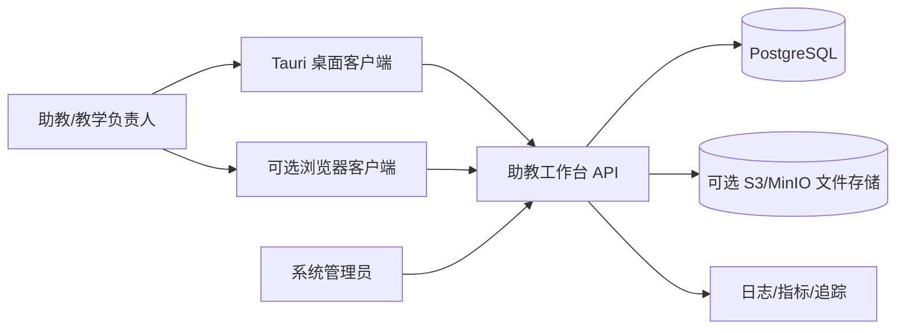
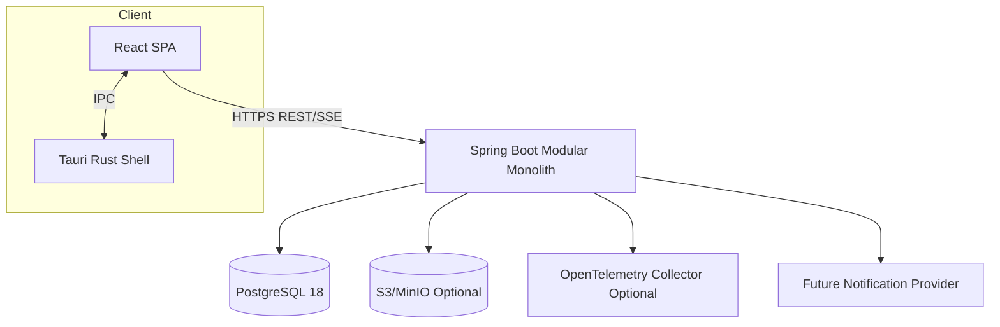
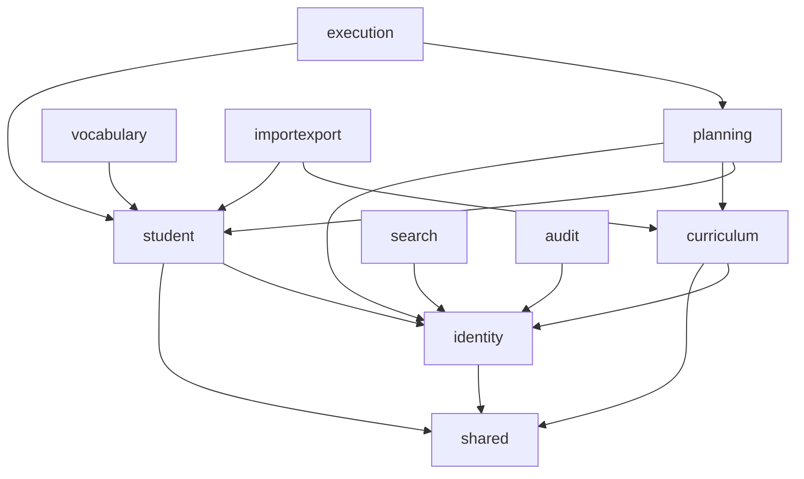
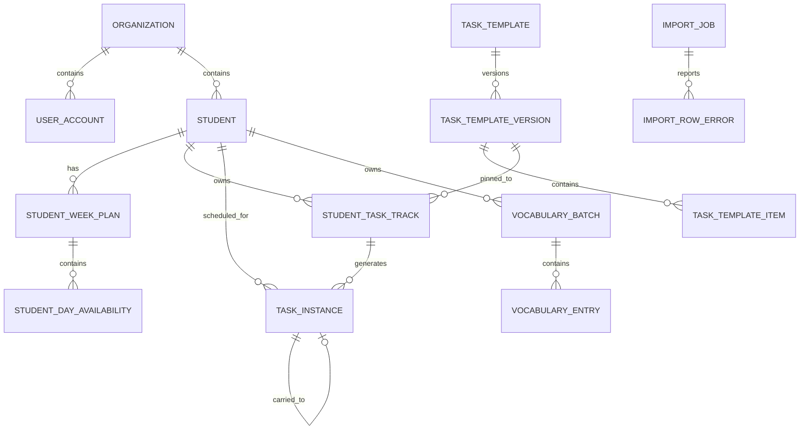

# 助教工作台开发设计文档（SDD）

> 文档版本：v1.0  
> 文档状态：架构基线 / 可进入任务拆分与原型开发  
> 编制日期：2026-08-16  
> 上游文档：《助教工作台需求规格与竞品研究（PRD）v1.0》  
> 目标读者：技术负责人、前端、后端、桌面端、测试、运维和产品负责人

---

# 0. 文档目标与约束

## 0.1 目标

本文件将 PRD 转换为可编码的系统设计，重点回答：

1. 系统采用什么总体架构，为什么；
2. 前端、桌面壳、后端和数据库如何分工；
3. 需要哪些全局字段、实体、状态机和约束；
4. 完成、顺延、轨道推进、拖拽改期和模板版本如何实现；
5. API、函数、后台任务和前端组件如何划分；
6. 如何减少自研代码，同时避免许可证和架构债务；
7. 如何测试、观测、部署、升级和恢复。

## 0.2 设计约束

- 客户当前主要是机构内部助教使用，桌面端优先；
- 系统必须保留未来浏览器访问能力，不能把业务逻辑写死在桌面壳；
- 第一版规模按单机构 20—100 名助教、数百至数千学生、百万级历史任务以内设计；
- 业务以在线协作为主，不把完整业务数据库放在每台桌面客户端；
- 不能依赖“大模型每次现场决策”维持核心正确性；
- 自动顺延、完成和轨道推进必须可重试、幂等、可审计；
- 采用模块化单体而不是一开始拆微服务；
- 允许使用成熟开源组件，但所有依赖必须通过许可证门禁。

## 0.3 架构结论

推荐架构：

> **Tauri 2 原生桌面壳 + React/TypeScript Web UI + Spring Boot/Spring Modulith 模块化单体 + PostgreSQL + REST/OpenAPI。**

核心理由：

- Tauri 可以使用现有 Web 前端并生成 Windows/macOS/Linux 应用，桌面原生能力通过最小权限 IPC 暴露；
- React 生态适合高密度表格、虚拟滚动、拖拽和日历；
- Spring Boot 与 Spring Modulith 提供成熟的事务、安全、模块边界验证、事件发布、模块测试和可观测能力；
- PostgreSQL 适合强一致关系数据、日期查询、全文/模糊搜索、部分唯一索引和审计；
- 模块化单体保持一次部署和单数据库事务，避免当前规模下微服务引入网络、消息、分布式一致性和运维成本；
- OpenAPI 生成前端客户端，减少手写 DTO 和字段漂移；
- 桌面壳保持薄层，未来可直接部署同一 React UI 为浏览器版本。

Spring Modulith 官方能力包括应用模块结构验证、单模块集成测试、事件发布注册、模块级观测和文档生成，适合作为本项目业务边界的自动门禁。Tauri 2 的 Capability/Permission 模型可按窗口限制原生能力，符合“桌面壳薄、最小权限”的原则。

---

# 1. 外部经验对架构的映射

| 外部模式 | 技术映射 |
|---|---|
| TickTick/Todoist 的 Today 与拖动改期 | `TaskInstance` 作为日期化执行项；前端乐观更新 + 服务端版本校验 |
| Asana/monday 的资源行 × 时间轴 | 自定义虚拟化 Student Schedule Grid；学生首列冻结，日期列虚拟化 |
| Dynamics 365 的 Work Order / Requirement / Booking 分层 | `TaskTemplate` / `StudentTaskTrack` / `TaskInstance` 分层 |
| ServiceNow Dispatcher 的任务面板与上下文侧栏 | 可收起 Quick Add Drawer、Task Detail Drawer、保存过滤条件 |
| Maximo Job Plan / PM | 版本化模板、连续单元、下一到期日和可靠后台任务 |
| 教培系统的学生档案 | 学生资料、可用时间、设备和学科偏好为独立域对象 |
| 工单系统的审计和状态机 | 所有写操作产生日志，状态转换只经领域服务执行 |

不采用的模式：

- 不把 FullCalendar Premium Resource Timeline 作为多学生主工作台依赖。其资源时间轴属于商业插件；主工作台将使用 TanStack Table/Virtual + dnd-kit 自定义，以控制许可证、密度和业务交互。FullCalendar 标准 MIT 插件仅用于单学生日/周/月视图。
- 不把通用项目管理系统作为代码基座。Plane、OpenProject、Vikunja 等适合研究，但其 AGPL/GPL 许可证和对象模型不适合直接混入闭源核心。
- 不从微服务、Kafka、Elasticsearch 或复杂工作流引擎起步。P0 的一致性需求在单体 + PostgreSQL 事务中更容易保证。

---

# 2. 技术栈与版本策略

## 2.1 推荐技术矩阵

| 层 | 推荐技术 | 用途 | 选择理由 |
|---|---|---|---|
| 桌面壳 | Tauri 2.x + Rust stable | 安装包、窗口、更新、通知、文件选择、安全凭据 | 小型二进制；复用 Web UI；Capability 最小权限；官方更新插件 |
| 前端 | React 19 + TypeScript strict + Vite | 页面与交互 | 生态成熟、组件丰富、适合复杂交互和类型化开发 |
| 企业 UI | Ant Design 6.x | 表单、弹窗、抽屉、按钮、标签、反馈 | 完整企业组件；MIT；减少基础 UI 自研 |
| 高密度表格 | TanStack Table 8 + TanStack Virtual | 学生工作台、模板表格、虚拟行列 | Headless，可自定义密度；支持固定列、排序、筛选、虚拟化 |
| 服务端状态 | TanStack Query 5 | 查询缓存、失效、乐观更新、错误回滚 | 避免用全局 Store 复制服务端数据 |
| UI 状态 | Zustand | 抽屉、视图密度、临时选择、快捷面板 | 轻量，仅存跨组件 UI 状态 |
| 路由 | React Router 7 | 浏览器/桌面共享路由 | 路由成熟，支持参数与嵌套路由 |
| 拖拽 | dnd-kit stable | 日期拖拽、模板挂载、排序 | MIT；键盘传感器和可访问性；可扩展碰撞检测 |
| 单学生日历 | FullCalendar Standard | 单学生日/周/月视图 | 标准插件 MIT；成熟拖放和 Calendar API |
| 表单 | React Hook Form + Zod | 资料、模板、导入映射、任务编辑 | 少重渲染；运行时校验与 TypeScript 类型统一 |
| API 客户端 | OpenAPI 3.1 + 代码生成 | 类型、请求方法、错误模型 | 减少前后端手写重复和字段漂移 |
| 后端 | Java 21 LTS + Spring Boot 4.1.x | REST、事务、安全、调度、监控 | 当前稳定 Spring 代际；Java 21 成熟并具长期支持 |
| 模块化 | Spring Modulith 2.1.x | 模块验证、事件、测试、文档、观测 | 官方领域模块工具；适合模块化单体 |
| 数据库 | PostgreSQL 18.x 当前小版本 | 主数据、事务、搜索、审计 | 支持期长；关系、JSONB、全文、trigram、部分索引 |
| 数据访问 | Spring Data JPA + JdbcClient | 聚合写入与复杂读模型 | JPA 减少 CRUD；JdbcClient 避免复杂矩阵查询产生 N+1 |
| 数据迁移 | Flyway | 版本化 DDL/DML | schema history、校验和、可审计迁移 |
| 定时任务 | Quartz JDBC JobStore | 日结、顺延、导入处理、维护 | 持久化、misfire、集群锁和重试能力成熟 |
| Excel | Apache POI | XLSX 解析与导出 | Java 生态成熟，支持流式读取 |
| API 文档 | springdoc-openapi | OpenAPI 输出与 Swagger UI | 与 Spring MVC 集成 |
| 测试 | JUnit 5、AssertJ、Testcontainers、Vitest、Testing Library、Playwright | 多层测试 | 单元、模块、数据库和端到端覆盖 |
| 可观测 | Spring Actuator、Micrometer、OpenTelemetry、结构化 JSON 日志 | 指标、追踪、健康检查 | Spring 官方集成和供应商中立 |
| CI/CD | GitHub Actions 或企业等价平台 | 构建、测试、制品、签名 | 可替换，不把业务绑死到特定平台 |

## 2.2 版本冻结规则

1. 文档中的版本表示推荐主线，不要求在开发中永远追最新小版本。
2. 项目启动时生成 `dependency-lock.md`，记录精确版本、许可证、来源和升级策略。
3. 只升级当前受支持的安全小版本；大版本升级必须有 ADR、回归测试和数据库兼容验证。
4. Tauri、桌面签名、自动更新、Spring Boot 和 PostgreSQL 为高风险升级项，禁止自动合并 Dependabot/Renovate 大版本 PR。
5. 前端依赖使用 lockfile；Java 使用 dependency management/BOM；Rust 提交 `Cargo.lock`。

## 2.3 备选方案及拒绝理由

| 方案 | 结论 | 原因 |
|---|---|---|
| Electron | 备选，不首选 | Node/Chromium 生态成熟，但安装体积和运行内存更高；本项目原生能力较少，Tauri 更合适 |
| Vue 3 | 可行但不选 | 技术能力足够；当前复用的表格、Query、组件和团队范式按 React 统一可减少选择成本 |
| NestJS 全栈 TypeScript | 可行但不选 | 统一语言是优势；但该项目事务、调度、安全、模块验证和长期企业维护更适合 Spring 生态 |
| 微服务 | 暂不采用 | 业务边界尚在快速变化，当前规模无需独立扩缩容；会显著增加一致性和运维成本 |
| SQLite 本地优先 | 不作为主存储 | 多助教协作、权限、备份和并发需要中心数据库；可在 P1 做有限离线草稿缓存 |
| Elasticsearch/OpenSearch | P0 不采用 | PostgreSQL trigram/FTS 足够；避免增加集群和同步问题 |
| Camunda/Temporal | P0 不采用 | 当前流程是有限状态机与定时顺延，领域代码更直接；复杂长流程出现后再评估 |

---

# 3. 系统上下文与部署拓扑

## 3.1 C4 Context



## 3.2 Container



## 3.3 P0 部署单元

- `ta-workbench-desktop`：Tauri 安装包，包含编译后的 React 静态资源；
- `ta-workbench-api`：单个 Spring Boot 容器/进程；
- `postgres`：独立数据库实例；
- `object-storage`：可选，仅在保留原始导入文件、导出制品时启用；
- 反向代理/TLS：Nginx、Caddy、云负载均衡或企业网关之一。

API 与定时任务在 P0 可运行于同一进程，但代码上分为 HTTP adapter 和 Job adapter。若任务量增加，可将同一应用制品以 `worker` profile 独立启动，不改变领域模块。

## 3.4 在线与离线边界

- 中心数据库是唯一事实源；
- 桌面端仅缓存查询、用户偏好和未提交的表单草稿；
- P0 不承诺断网完成业务写入；断网时显示只读缓存和恢复提示；
- P1 可增加有限 Outbox Draft Queue，但完成/顺延等影响进度的操作不在无冲突机制下离线提交。

---

# 4. 代码仓库与目录

推荐单仓库：

```text
assistant-workbench/
├── apps/
│   ├── web/                         # React/Vite，同一构建供浏览器与 Tauri 使用
│   │   ├── src/
│   │   │   ├── app/                 # 路由、Provider、全局错误边界
│   │   │   ├── features/            # 按业务能力垂直切片
│   │   │   │   ├── today/
│   │   │   │   ├── students/
│   │   │   │   ├── scheduling/
│   │   │   │   ├── templates/
│   │   │   │   ├── vocabulary/
│   │   │   │   ├── search/
│   │   │   │   └── auth/
│   │   │   ├── components/          # 真正跨域 UI 组件
│   │   │   ├── api/                 # 生成的 API 客户端与薄封装
│   │   │   ├── stores/              # UI 状态，不保存服务端事实
│   │   │   ├── lib/                 # 日期、格式化、权限等纯函数
│   │   │   └── test/
│   │   └── package.json
│   ├── desktop/
│   │   ├── src-tauri/
│   │   │   ├── src/
│   │   │   ├── capabilities/
│   │   │   ├── icons/
│   │   │   └── tauri.conf.json
│   │   └── package.json
│   └── api/
│       ├── src/main/java/com/wonderedu/assistant/
│       │   ├── identity/
│       │   ├── student/
│       │   ├── curriculum/
│       │   ├── planning/
│       │   ├── execution/
│       │   ├── vocabulary/
│       │   ├── search/
│       │   ├── importexport/
│       │   ├── audit/
│       │   ├── shared/
│       │   └── AssistantApplication.java
│       ├── src/main/resources/db/migration/
│       ├── src/test/
│       └── build.gradle.kts
├── packages/
│   ├── api-client/                  # OpenAPI 生成输出
│   ├── design-tokens/               # 颜色、密度、尺寸、状态语义
│   └── test-fixtures/               # 前端 mock 与共享样例，不含业务实现
├── docs/
│   ├── adr/
│   ├── api/
│   ├── data-dictionary/
│   └── runbooks/
├── infra/
│   ├── docker/
│   ├── compose/
│   └── monitoring/
├── scripts/
├── .github/workflows/
├── LICENSES/
├── THIRD_PARTY_NOTICES.md
└── README.md
```

## 4.1 前端依赖方向

```text
app/routes
   ↓
features/*/pages
   ↓
features/*/components + features/*/queries + features/*/domain
   ↓
api/generated + shared components + pure lib
```

规则：

- feature 之间不得直接导入内部组件；跨域通过公共 API 或路由参数；
- React 组件不得直接计算“下一可学习日”或轨道推进；这些规则在后端领域层；
- Zustand 不保存学生、任务或轨道完整副本；服务端事实由 TanStack Query 管理；
- `api/generated` 不手工修改；封装仅处理认证、错误映射和 query key。

## 4.2 后端模块结构

每个模块采用相同布局：

```text
planning/
├── api/                 # 对其他模块公开的命令、查询接口和事件类型
├── application/         # Use case、事务边界、命令/查询处理
├── domain/              # 聚合、值对象、领域规则、仓储接口
├── infrastructure/      # JPA/JDBC、外部适配器、数据库映射
└── web/                 # Controller、HTTP DTO、权限注解
```

`internal` 实现不允许被其他模块直接引用。Spring Modulith 的模块验证测试必须在 CI 中执行，禁止循环依赖。


---

# 5. 领域模块与边界

## 5.1 模块清单

| 模块 | 责任 | 主要聚合/对象 | 发布事件 |
|---|---|---|---|
| identity | 组织、用户、角色、会话、数据范围 | Organization、UserAccount、RoleAssignment | UserDisabled、RoleChanged |
| student | 学生档案、标签、负责关系、学习条件 | Student、StudentWeekPlan | StudentUpdated、AvailabilityChanged |
| curriculum | 任务模板、版本、模板单元、发布与归档 | TaskTemplate、TemplateVersion | TemplatePublished、TemplateRetired |
| planning | 学生任务轨道、每日排期、拖拽改期、锁定 | StudentTaskTrack、TaskInstance | TrackMounted、TaskScheduled、TaskRescheduled |
| execution | Checklist、完成、重新打开、顺延、日结 | TaskExecution | TaskCompleted、TaskCarriedOver、TrackAdvanceRequested |
| vocabulary | 生词批次、词条、汇总、复测 | VocabularyBatch、VocabularyEntry | VocabularyBatchCreated |
| search | 全局搜索读模型、日期解析、权限过滤 | SearchDocument | 无业务主聚合 |
| importexport | Excel 导入预览、执行、错误、导出 | ImportJob、ExportJob | ImportCompleted |
| audit | 不可变业务审计、操作追踪 | AuditEvent | 无 |
| shared | 时钟、ID、租户上下文、错误模型、事务辅助 | Value Objects | 无业务事件 |

## 5.2 模块依赖方向



约束：

- `planning` 可以调用 student/curriculum 暴露的只读端口，但不能引用其 JPA 实体；
- `execution` 通过 planning 的公开命令推进轨道和生成新实例；不直接写 planning 表；
- search 订阅领域事件构建读模型，不成为主数据写入口；
- audit 由统一拦截器和领域事件写入，业务模块不可用 audit 反向驱动业务；
- importexport 只编排导入，不绕过 curriculum/student 的领域校验。

## 5.3 同步调用与事件

同步调用用于：

- 当前用例需要立即得到校验结果；
- 必须处于同一数据库事务；
- 例如完成每日任务时更新任务状态和轨道指针。

模块事件用于：

- 更新搜索读模型；
- 写审计和指标；
- 异步导出/通知；
- 将来拆分 worker；
- 降低非核心副作用对主事务的耦合。

核心状态不得依赖“可能丢失的普通内存事件”。采用 Spring Modulith 的持久化 Event Publication Registry；监听器必须幂等。外部消息中间件在 P0 不启用，但事件类型和处理器保持可外部化。

---

# 6. 全局数据规范

## 6.1 标识符

- 所有业务主键使用 UUID；由应用层生成，避免数据库往返；
- API 中 UUID 使用标准小写连字符字符串；
- 业务可读代码单独存储，例如 `student_code`、`template_code`；
- 不将数据库自增 ID 暴露为跨系统标识。

## 6.2 通用审计字段

所有可变业务表至少包含：

| 字段 | 类型 | 必填 | 业务含义 |
|---|---|---:|---|
| id | uuid | 是 | 主键 |
| organization_id | uuid | 是 | 租户/机构隔离键 |
| created_at | timestamptz | 是 | UTC 创建时间 |
| created_by | uuid | 是 | 创建用户；系统任务使用系统账号 |
| updated_at | timestamptz | 是 | UTC 最近修改时间 |
| updated_by | uuid | 是 | 最近修改用户 |
| version | bigint | 是 | 乐观锁版本，从 0 开始 |

根据实体生命周期增加：

| 字段 | 用途 |
|---|---|
| archived_at / archived_by | 不再参与默认查询，但保留历史 |
| status | 领域状态，不能用 archived 代替业务状态 |
| external_ref | 与旧系统或导入源映射 |

禁止把所有可选内容塞入一个 JSONB。JSONB 仅用于低频扩展、导入原始元数据或不会参与核心约束的内容。

## 6.3 时间与日期

- 时间戳使用 `timestamptz` 并以 UTC 写入；
- 排期使用 `scheduled_date date`，按组织 `business_timezone` 解释；
- 组织保存 `business_timezone`（IANA 名称）和 `day_close_time`；
- 周使用 ISO week：`week_start_date` 固定为周一；
- 前端不根据本机时区自行决定业务日期，启动时从 `/context` 获取服务器计算结果；
- 日期解析结果必须返回绝对日期和时区说明。

## 6.4 文本与枚举

- 名称字段使用 `varchar` 并在数据库设置合理长度；长说明用 `text`；
- 状态在 Java 中使用 Enum，在数据库使用 `varchar` + CHECK，而不是 PostgreSQL enum，以便迁移；
- 搜索规范化字段使用小写、去全半角差异、可选拼音/英文别名；
- 用户输入原文和规范化结果分开保存，特别是生词和导入数据。

## 6.5 删除策略

- 学生、模板、轨道、用户：归档/停用；
- 每日任务实例、完成历史、顺延历史、审计：不可物理删除；
- 导入暂存和失败明细可按保留策略清理；
- 对测试/错误创建的数据提供管理员“作废”而不是 DELETE；
- 真正物理删除仅用于合规数据清除，需专用审批与审计流程。

## 6.6 并发与幂等

- 所有可编辑聚合使用 `version` 乐观锁；
- 更新 API 要求客户端提交 `version` 或 `If-Match`；
- 冲突返回 HTTP 409 + 当前实体摘要；
- 高风险命令接受 `Idempotency-Key`；
- `idempotency_record` 保存键、用户、命令类型、请求摘要、结果引用和有效期；
- 后台任务使用稳定业务幂等键，例如 `carryover:{sourceTaskId}:{targetDate}`；
- 批处理采用 `SELECT ... FOR UPDATE SKIP LOCKED` 或 Quartz 集群锁避免重复处理。

---

# 7. 数据模型总览



---

# 8. 数据字典

## 8.1 organization

| 字段 | 类型 | 约束/说明 |
|---|---|---|
| id | uuid | PK |
| code | varchar(50) | 唯一，机构代码 |
| name | varchar(200) | 机构名称 |
| business_timezone | varchar(64) | 例如 `Asia/Shanghai` |
| day_close_time | time | 默认 `05:00:00`，需产品确认 |
| carryover_horizon_days | int | 默认 90，寻找下一可学习日上限 |
| status | varchar(20) | ACTIVE/INACTIVE |
| settings | jsonb | 非核心扩展设置 |
| created_at...version | 通用字段 | 机构自身 `organization_id` 可等于 id 或单独省略 |

索引：`unique(code)`。

## 8.2 user_account

| 字段 | 类型 | 说明 |
|---|---|---|
| id | uuid | PK |
| organization_id | uuid | FK |
| username | varchar(100) | 机构内唯一 |
| display_name | varchar(100) | 显示名 |
| email | varchar(255) | 可空，规范化后唯一策略按机构配置 |
| password_hash | varchar(255) | 本地认证时使用 |
| status | varchar(20) | ACTIVE/LOCKED/DISABLED |
| locale | varchar(20) | 默认 zh-CN |
| timezone | varchar(64) | 可空，默认组织时区 |
| last_login_at | timestamptz | 可空 |
| created_at...version | 通用字段 | |

角色使用 `user_role_assignment(user_id, role_code, scope_type, scope_id)`；首版 scope 可为 ORGANIZATION 或 STUDENT_SET。

## 8.3 student

| 字段 | 类型 | 说明 |
|---|---|---|
| id | uuid | PK |
| organization_id | uuid | 租户键 |
| student_code | varchar(50) | 机构内唯一、可读编号 |
| name | varchar(100) | 姓名 |
| alias | varchar(100) | 可空，搜索别名 |
| status | varchar(20) | ACTIVE/PAUSED/ARCHIVED |
| class_type | varchar(100) | 班型/阶段 |
| enrollment_date | date | 可空 |
| default_device_policy | varchar(20) | ALLOWED/NOT_ALLOWED/CONFIRM |
| primary_assistant_id | uuid | 主要助教，可空 |
| note | text | 备注，需权限 |
| search_text | text | 规范化搜索辅助，可由读模型替代 |
| archived_at... | 可空 | 归档 |
| created_at...version | 通用字段 | |

约束与索引：

- `unique(organization_id, student_code)`；
- `index(organization_id, status, primary_assistant_id)`；
- 姓名/别名使用 trigram 索引或统一 search_document；
- student 不直接保存“本周每天时间”的 JSON，必须使用周计划表。

## 8.4 student_tag 与 student_subject_preference

`student_tag`：`student_id`、`tag_code`、`tag_name_snapshot`、通用字段。用于班型、风险或运营标签。

`student_subject_preference`：

| 字段 | 类型 | 说明 |
|---|---|---|
| student_id | uuid | FK |
| subject_code | varchar(30) | LISTENING/READING/WRITING/SPEAKING/VOCABULARY/OTHER |
| priority | smallint | 1—5，5 最高 |
| target_ratio | numeric(5,2) | P1，可空 |
| note | varchar(500) | 可空 |

唯一约束：`(student_id, subject_code)`。

## 8.5 student_weekly_pattern

表示学生常规周，不绑定具体日期：

| 字段 | 类型 | 说明 |
|---|---|---|
| id | uuid | PK |
| student_id | uuid | FK，通常一条 ACTIVE |
| effective_from | date | 生效日期 |
| effective_to | date | 可空 |
| status | varchar(20) | ACTIVE/RETIRED |
| created_at...version | 通用字段 | |

其子表 `student_weekly_pattern_day`：

| 字段 | 类型 | 说明 |
|---|---|---|
| pattern_id | uuid | FK |
| day_of_week | smallint | ISO 1—7 |
| available | boolean | 默认 true |
| available_minutes | int | 0—1440 |
| device_policy_override | varchar(20) | 可空 |

唯一：`(pattern_id, day_of_week)`。

## 8.6 student_week_plan

表示某个具体 ISO 周的计划快照：

| 字段 | 类型 | 说明 |
|---|---|---|
| id | uuid | PK |
| student_id | uuid | FK |
| week_start_date | date | 必须周一 |
| source_type | varchar(20) | BASE_PATTERN/PREVIOUS_WEEK/MANUAL/IMPORT |
| source_id | uuid | 可空 |
| status | varchar(20) | DRAFT/CONFIRMED/CLOSED |
| confirmed_at/by | timestamptz/uuid | 可空 |
| created_at...version | 通用字段 | |

唯一：`(student_id, week_start_date)`。

`student_day_availability`：

| 字段 | 类型 | 说明 |
|---|---|---|
| id | uuid | PK |
| week_plan_id | uuid | FK |
| student_id | uuid | 冗余租户安全与查询效率，需一致性约束 |
| business_date | date | 周内日期 |
| available | boolean | 是否可学习 |
| available_minutes | int | 可空或 0；可学习时必须 >= 0 |
| device_policy_override | varchar(20) | 可空 |
| note | varchar(500) | 可空 |
| created_at...version | 通用字段 | |

唯一：`(student_id, business_date)`；检查 business_date 属于对应周。

## 8.7 task_template

| 字段 | 类型 | 说明 |
|---|---|---|
| id | uuid | PK |
| organization_id | uuid | 租户键 |
| template_code | varchar(80) | 机构内唯一，如 `VOCAB_807` |
| name | varchar(200) | 如“807词汇” |
| short_name | varchar(50) | 工作台紧凑显示 |
| subject_code | varchar(30) | 科目 |
| category_code | varchar(50) | 类别 |
| unit_label | varchar(20) | 节/篇/Day/P 等 |
| default_duration_minutes | int | 可空；1—1440 |
| default_requires_device | boolean | 默认设备要求 |
| status | varchar(20) | DRAFT/ACTIVE/RETIRED/ARCHIVED |
| current_published_version_id | uuid | 可空 |
| description | text | |
| tags | jsonb | 仅低频扩展 |
| created_at...version | 通用字段 | |

唯一：`(organization_id, template_code)`；索引 subject/status。

## 8.8 task_template_version

| 字段 | 类型 | 说明 |
|---|---|---|
| id | uuid | PK |
| template_id | uuid | FK |
| version_number | int | 从 1 递增 |
| status | varchar(20) | DRAFT/PUBLISHED/RETIRED |
| item_count | int | 发布时计算 |
| change_note | text | |
| published_at/by | timestamptz/uuid | 可空 |
| checksum | varchar(64) | 单元内容规范化摘要 |
| created_at...version | 通用字段 | |

唯一：`(template_id, version_number)`；同模板最多一个 DRAFT，可用部分唯一索引。

## 8.9 task_template_item

| 字段 | 类型 | 说明 |
|---|---|---|
| id | uuid | PK |
| template_version_id | uuid | FK |
| ordinal | int | 从 1 开始、同版本唯一 |
| item_code | varchar(80) | 稳定可读代码，可为空时自动生成 |
| title | varchar(500) | 完整标题 |
| short_title | varchar(80) | 紧凑视图标题 |
| duration_minutes | int | 可空，覆盖模板默认值 |
| requires_device | boolean | 可空，覆盖模板默认值 |
| content_ref | varchar(500) | 链接、课程或文件引用，可空 |
| instructions | text | 可空 |
| metadata | jsonb | 导入源行号等非核心信息 |
| active | boolean | 草稿内可停用；发布后不可原地变更 |
| created_at...version | 通用字段 | |

唯一：`(template_version_id, ordinal)`、`(template_version_id, item_code)`（item_code 非空时）。

## 8.10 student_task_track

| 字段 | 类型 | 说明 |
|---|---|---|
| id | uuid | PK |
| student_id | uuid | FK |
| template_id | uuid | FK |
| template_version_id | uuid | 固定版本 |
| status | varchar(20) | NOT_STARTED/ACTIVE/PAUSED/COMPLETED/CANCELLED |
| start_ordinal | int | 起始单元 |
| current_ordinal | int | 当前第一个未完成单元；完成后可为 end+1 |
| end_ordinal | int | 结束单元 |
| default_units_per_session | int | 默认 1 |
| start_date | date | 计划启动日 |
| next_candidate_date | date | 可空，读优化，不作为唯一事实 |
| priority | smallint | 1—100 |
| allow_parallel_items | boolean | 默认 false；允许同日多个连续单元时 true |
| scheduling_policy | varchar(30) | MANUAL/ROLLING/AUTO_CAPACITY |
| duration_override_minutes | int | 可空 |
| device_policy_override | varchar(20) | 可空 |
| note | text | |
| completed_at/by | timestamptz/uuid | 可空 |
| created_at...version | 通用字段 | |

约束：

- `1 <= start_ordinal <= current_ordinal <= end_ordinal + 1`；
- template_version 必须属于 template；
- ordinal 范围必须存在于已发布版本；
- 同一学生可挂同一模板多条轨道，但默认 UI 提示重复；
- `COMPLETED` 时 current_ordinal = end_ordinal + 1。

索引：`(student_id, status)`、`(template_id, status)`、`(organization_id, status, next_candidate_date)`。

## 8.11 task_instance

这是系统最重要的执行表：

| 字段 | 类型 | 说明 |
|---|---|---|
| id | uuid | PK |
| organization_id | uuid | 租户键 |
| student_id | uuid | 归属学生 |
| source_type | varchar(20) | TRACK/AD_HOC/IMPORT |
| track_id | uuid | 轨道任务必填 |
| template_version_id | uuid | 快照引用，可空 |
| template_item_id | uuid | 轨道任务必填 |
| item_ordinal | int | 快照，便于查询 |
| scheduled_date | date | 当前执行日期 |
| original_scheduled_date | date | 首次计划日期 |
| status | varchar(20) | PENDING/COMPLETED/CARRIED_OVER/CANCELLED/SKIPPED/BLOCKED |
| title_snapshot | varchar(500) | 历史显示真值 |
| short_title_snapshot | varchar(80) | 紧凑显示 |
| duration_minutes_snapshot | int | 可空 |
| requires_device_snapshot | boolean | |
| schedule_origin | varchar(20) | AUTO/MANUAL/IMPORT/CARRYOVER |
| manual_override | boolean | 是否无视冲突 |
| override_reason | varchar(500) | override 时必填或按角色策略 |
| locked | boolean | 自动流程不得移动 |
| note | text | |
| carried_from_instance_id | uuid | 新实例指向来源 |
| carried_to_instance_id | uuid | 原实例指向目标 |
| completed_at/by | timestamptz/uuid | 可空 |
| cancelled_at/by | timestamptz/uuid | 可空 |
| created_at...version | 通用字段 | |

约束与索引：

- TRACK 来源必须有 track_id/template_item_id/item_ordinal；AD_HOC 必须为空；
- `original_scheduled_date <= scheduled_date` 仅对自动顺延成立，人工提前可小于，因此不能做通用 CHECK；
- `carried_from_instance_id` 与 `carried_to_instance_id` 不得自引用；
- `COMPLETED` 必须有 completed_at/by；
- 部分唯一索引：`unique(track_id, template_item_id) where status='PENDING'`，防止同一轨道单元出现两个当前待办；
- `index(student_id, scheduled_date, status)`；
- `index(organization_id, scheduled_date, status)`；
- `index(track_id, item_ordinal, status)`；
- `index(carried_from_instance_id)`。

注意：若同一天安排同一轨道的多个连续单元，每个单元建立独立 task_instance。轨道指针只推进到第一个未完成单元，支持“能力强的学生一天完成两个单元”且保留粒度。

## 8.12 vocabulary_batch

| 字段 | 类型 | 说明 |
|---|---|---|
| id | uuid | PK |
| student_id | uuid | FK |
| occurred_date | date | 生词产生日期 |
| source_type | varchar(30) | LISTENING_TEST/READING/HOMEWORK/MANUAL/RETEST/OTHER |
| subject_code | varchar(30) | 可空 |
| source_label | varchar(200) | 例如“807听写第8节” |
| note | text | |
| raw_input | text | 可选，保留批量粘贴原文 |
| created_at...version | 通用字段 | |

## 8.13 vocabulary_entry

| 字段 | 类型 | 说明 |
|---|---|---|
| id | uuid | PK |
| batch_id | uuid | FK |
| student_id | uuid | 冗余便于查询 |
| term_original | varchar(300) | 原始词条 |
| term_normalized | varchar(300) | 规范化词条 |
| status | varchar(20) | ACTIVE/MASTERED/ARCHIVED |
| source_entry_id | uuid | 复测回流时可指向前次 |
| note | varchar(1000) | 可空 |
| created_at...version | 通用字段 | |

索引：`(student_id, created_at)`、`(student_id, term_normalized)`；默认允许跨批次重复，因为重复错误本身有业务价值，UI 只提示而不强制去重。

## 8.14 import_job

| 字段 | 类型 | 说明 |
|---|---|---|
| id | uuid | PK |
| type | varchar(30) | TEMPLATE_XLSX/STUDENT_XLSX 等 |
| status | varchar(20) | UPLOADED/PREVIEWED/RUNNING/SUCCEEDED/PARTIAL/FAILED/CANCELLED |
| file_name | varchar(255) | |
| file_sha256 | varchar(64) | 去重与审计 |
| storage_key | varchar(500) | 可空 |
| mapping_config | jsonb | 列映射 |
| summary | jsonb | 行数、成功数、错误数 |
| requested_by | uuid | |
| started_at/finished_at | timestamptz | 可空 |
| created_at...version | 通用字段 | |

`import_row_error` 保存 sheet、row、column、field、error_code、message、raw_value。导入预览可使用暂存表或 JSONB，但最终业务写入必须走领域服务。

## 8.15 audit_event

| 字段 | 类型 | 说明 |
|---|---|---|
| id | uuid | PK |
| organization_id | uuid | 租户键 |
| occurred_at | timestamptz | 事件时间 |
| actor_type | varchar(20) | USER/SYSTEM |
| actor_id | uuid | 可空 |
| action | varchar(80) | TASK_COMPLETED、TASK_RESCHEDULED 等 |
| aggregate_type | varchar(50) | STUDENT/TRACK/TASK_INSTANCE/... |
| aggregate_id | uuid | |
| correlation_id | varchar(100) | 请求/批任务关联 |
| before_data | jsonb | 仅必要字段，脱敏 |
| after_data | jsonb | 仅必要字段，脱敏 |
| metadata | jsonb | IP、客户端版本、规则编号等 |

审计表只追加；更新和删除权限仅限维护脚本。按月份分区可在数据量增长后启用。

## 8.16 idempotency_record

| 字段 | 类型 | 说明 |
|---|---|---|
| organization_id | uuid | |
| idempotency_key | varchar(200) | |
| command_type | varchar(80) | |
| actor_id | uuid | |
| request_hash | varchar(64) | 同键不同载荷需 409 |
| status | varchar(20) | IN_PROGRESS/SUCCEEDED/FAILED |
| result_type | varchar(50) | |
| result_id | uuid | 可空 |
| response_snapshot | jsonb | 可选、限制大小 |
| expires_at | timestamptz | |

主键/唯一：`(organization_id, idempotency_key)`。

## 8.17 search_document

用于统一搜索读模型：

| 字段 | 类型 | 说明 |
|---|---|---|
| id | uuid | 搜索文档 ID |
| organization_id | uuid | |
| document_type | varchar(30) | STUDENT/TEMPLATE/TEMPLATE_ITEM/TASK_INSTANCE |
| entity_id | uuid | |
| title | varchar(500) | |
| subtitle | varchar(500) | |
| normalized_text | text | 规范化关键词 |
| tsv | tsvector | PostgreSQL 全文索引 |
| permission_scope | jsonb | 低频辅助；最终仍需 SQL 权限条件 |
| payload | jsonb | 结果卡片必要字段 |
| updated_at | timestamptz | |

唯一：`(organization_id, document_type, entity_id)`；GIN(tsv) + GIN/GiST trigram(normalized_text)。


---

# 9. 核心领域服务与函数

本节中的函数名是建议的应用服务/领域服务接口，实际包名可调整，但输入、输出和不变量不得在实现时被弱化。

## 9.1 StudentService

### `createStudent(CreateStudentCommand)`

输入：organizationId、studentCode、name、defaultDevicePolicy、primaryAssistantId、classType、enrollmentDate、tags。  
输出：StudentView。  
规则：机构内 studentCode 唯一；主要助教必须属于同机构且有有效角色；同步创建默认常规周（周一至周日默认可学习，分钟数由组织默认或 0）。

### `updateStudentProfile(UpdateStudentProfileCommand)`

输入包含 expectedVersion。只更新资料字段，不隐式改排期。变更主要助教后发布 `StudentAssignmentChanged`。

### `saveWeeklyPattern(SaveWeeklyPatternCommand)`

校验 7 个 day item、分钟范围、effective date；关闭旧 ACTIVE pattern，再启用新 pattern。不能修改历史周计划。

### `createWeekPlan(CreateWeekPlanCommand)`

`sourceType` 可为 BASE_PATTERN、PREVIOUS_WEEK 或 MANUAL。生成 7 条 `student_day_availability`。若该周已有计划返回 409，除非 `replaceDraft=true` 且现有计划仍是 DRAFT。

### `updateDayAvailability(UpdateDayAvailabilityCommand)`

更新具体日期条件，并调用 `ScheduleImpactAnalyzer` 返回受影响任务列表。是否移动任务由后续显式命令决定。

## 9.2 CurriculumService

### `createTemplate(CreateTemplateCommand)`

创建 task_template 和 version 1 DRAFT。模板 code 规范化为大写下划线，允许用户提供但需唯一。

### `replaceDraftItems(ReplaceDraftItemsCommand)`

仅允许 DRAFT 版本。整个单元列表作为一个受版本控制的集合提交；服务端重新验证 ordinal 连续、itemCode 唯一、标题非空、时长合法，并计算 checksum。

### `publishTemplate(PublishTemplateCommand)`

事务步骤：

1. 加锁模板和草稿版本；
2. 验证至少一个 ACTIVE item、ordinal 连续；
3. version status → PUBLISHED；
4. 计算 item_count/checksum；
5. 旧 current version 可保留 PUBLISHED 或转 RETIRED，按策略执行；
6. template.current_published_version_id 更新；
7. 发布 `TemplatePublished`。

已发布版本和单元的业务字段不可更新。数据库层通过应用权限和触发式测试保证，首版不建议使用数据库触发器实现业务状态机。

### `createNextDraft(CreateNextDraftCommand)`

复制当前发布版本及单元，version_number +1，状态 DRAFT；保留 itemCode，允许在草稿中插入/停用/重排。

### `migrateTrackVersion(MigrateTrackVersionCommand)`

P1 功能。必须提供旧单元到新单元映射，预览进度影响；禁止仅凭 ordinal 自动迁移标题完全不同的模板。

## 9.3 TrackService

### `mountTrack(MountTrackCommand)`

输入：studentId、templateId/versionId、startOrdinal、endOrdinal、startDate、defaultUnitsPerSession、priority、policy、override。  
核心校验：

- 学生和模板属于同机构；
- 版本为 PUBLISHED；
- ordinal 范围存在且连续；
- 若 startDate 不可学习，返回 warning；老师确认 override 后仍可挂载；
- 默认不允许重复活跃轨道；若重复，返回可解释警告而不是数据库错误。

事务输出：创建 track；可根据请求在 startDate 创建首批 task_instance；发布 `TrackMounted`。

### `pauseTrack(PauseTrackCommand)`

暂停后不再自动产生新实例；现有 PENDING 实例处理方式由参数决定：KEEP、CANCEL、BLOCK。

### `resumeTrack(ResumeTrackCommand)`

重新计算下一候选日期，保持 currentOrdinal。

### `calculateTrackPointer(trackId)`

算法：

1. 读取 currentOrdinal；
2. 从 currentOrdinal 开始查询该轨道对应单元的 COMPLETED 实例；
3. 只沿连续 ordinal 前进；
4. 第一个未完成 ordinal 成为新 currentOrdinal；
5. 若超过 endOrdinal，track → COMPLETED；
6. 使用 expectedVersion 更新，冲突则重试有限次数。

伪代码：

```java
int advancePointer(Track track, Set<Integer> completedOrdinals) {
    int pointer = track.currentOrdinal();
    while (pointer <= track.endOrdinal() && completedOrdinals.contains(pointer)) {
        pointer++;
    }
    track.movePointerTo(pointer);
    if (pointer > track.endOrdinal()) track.complete(clock.instant(), actor);
    return pointer;
}
```

不得简单执行 `currentOrdinal + 1`，否则同日多单元、乱序完成和重复请求会产生错位。

## 9.4 SchedulingService

### `scheduleTrackItems(ScheduleTrackItemsCommand)`

输入：trackId、startOrdinal、unitCount、date、origin、manualOverride。  
规则：

- ordinal 范围必须从 currentOrdinal 开始连续，除非角色允许 manual skip；
- 对每个单元创建独立 task_instance；
- 若同单元已有 PENDING 实例，返回现有实例而非重复创建；
- 生成标题/时长/设备快照；
- 容量和设备冲突作为 warning；未确认时不提交；
- 所有实例写入同一事务。

### `createAdHocTask(CreateAdHocTaskCommand)`

必须有 studentId、scheduledDate、title；track/template 字段为空；title 限长并防止只含空白；可设置时长、设备和锁定。

### `rescheduleTask(RescheduleTaskCommand)`

仅允许 PENDING/BLOCKED。输入 targetDate、expectedVersion、override。流程：

1. 锁定实例；
2. 校验状态；
3. 调用 AvailabilityPolicy 和 CapacityPolicy；
4. 返回 warnings；
5. 未确认 warning 时不改变；
6. 更新 scheduledDate、scheduleOrigin=MANUAL、manualOverride；
7. 写审计并发布 TaskRescheduled。

拖拽 API 直接调用此命令，不创建专用“拖拽业务逻辑”。

### `lockTask/ unlockTask`

改变 locked；只有 PENDING/BLOCKED 可锁定。锁定不代表完成。

## 9.5 AvailabilityPolicy

### `resolveEffectiveAvailability(studentId, date)`

优先级：

1. 具体 `student_day_availability`；
2. 生效的 `student_weekly_pattern_day`；
3. 组织默认。

返回：available、availableMinutes、devicePolicy、source、note。

### `findNextAvailableDate(FindNextAvailableDateQuery)`

输入：studentId、afterDate（严格之后或含当日由参数控制）、requiresDevice、horizonDays、excludeDates。  
按日期逐日求有效可用性；条件：available=true 且若 requiresDevice，则 effectiveDevicePolicy=ALLOWED。容量是否作为硬条件由 policy 参数决定，P0 默认只作为软约束。超过 horizon 返回空并附原因。

```java
Optional<LocalDate> findNextAvailableDate(...) {
  for (int i = 1; i <= horizonDays; i++) {
    var candidate = afterDate.plusDays(i);
    var availability = resolveEffectiveAvailability(studentId, candidate);
    if (!availability.available()) continue;
    if (requiresDevice && availability.devicePolicy() != ALLOWED) continue;
    if (excluded.contains(candidate)) continue;
    return Optional.of(candidate);
  }
  return Optional.empty();
}
```

## 9.6 ExecutionService

### `completeTask(CompleteTaskCommand)`

输入：taskId、expectedVersion、idempotencyKey。  
事务不变量：任务完成和轨道指针推进不可出现一半成功。

流程：

```text
验证幂等键
→ SELECT task_instance FOR UPDATE
→ 校验 PENDING、权限、租户
→ 标记 COMPLETED + completed_at/by
→ 若 TRACK：查询同轨道连续完成单元，推进 Track
→ 写审计
→ 记录领域事件/事件发布记录
→ 提交
→ 返回 task + track + nextCandidate
```

若重复提交同一幂等键，返回第一次结果。若任务已经 COMPLETED 但幂等键不同，返回已完成状态，不再次推进。

### `reopenTask(ReopenTaskCommand)`

安全条件：

- 任务当前 COMPLETED；
- 没有比该 ordinal 更后的已完成单元，或可以通过连续重算安全回退；
- 相关轨道未迁移到其他模板版本；
- 操作者具备权限。

若不满足，返回 `TASK_REOPEN_REQUIRES_CORRECTION`，由负责人使用纠错命令。

### `carryOverTask(CarryOverTaskCommand)`

输入：sourceTaskId、targetDate 可空、reason、systemRunId。  
事务：

1. 锁定源实例；
2. 若非 PENDING 或 locked，返回 no-op；
3. 若 targetDate 为空，调用 findNextAvailableDate；
4. 找不到日期：源实例 → BLOCKED，记录原因；
5. 找到日期：源实例 → CARRIED_OVER；
6. 创建新 PENDING 实例，复制快照和关联，`carried_from_instance_id=source.id`；
7. 源 `carried_to_instance_id=new.id`；
8. 轨道指针不变；
9. 事件和审计；
10. 幂等唯一键防止重复新实例。

### `cancelTask` 与 `skipTask`

CANCELLED 表示该实例不再执行，但轨道单元仍未完成；系统可提示是否重新安排同单元。SKIPPED 表示有意跳过轨道单元，必须有角色权限和原因；若跳过当前单元，轨道指针可按规则推进，并写显著审计。

### `batchApply(BatchTaskCommand)`（P1）

用于 FR-TODAY-007。输入为任务 ID 列表、动作 `RESCHEDULE/CANCEL/LOCK/UNLOCK/COMPLETE`、动作参数、expectedVersion map 和 idempotencyKey。服务端先返回/校验预览摘要；执行时每个任务使用独立短事务，批次本身返回逐项 `SUCCEEDED/CONFLICT/FORBIDDEN/FAILED`，避免单项失败导致已确认的其他项被静默回滚。批量完成默认要求相同动作语义且逐项复用 `completeTask`，不得实现第二套推进逻辑。单批上限 200，超过返回 `BATCH_LIMIT_EXCEEDED`。

## 9.7 DayCloseJob

Quartz Job：`OrganizationDayCloseJob`。

输入 JobData：organizationId、businessDate、runId。  
选择范围：`scheduled_date <= businessDate AND status=PENDING AND locked=false`。  
处理策略：分页/批次 100—500 条，`FOR UPDATE SKIP LOCKED`。每条调用 `carryOverTask`，不在 Job 中重复业务逻辑。

Job 运行记录：

| 字段 | 说明 |
|---|---|
| run_id | 唯一运行 ID |
| organization_id | 机构 |
| business_date | 日结日期 |
| started_at/finished_at | 时间 |
| scanned/completed/carried/blocked/skipped/failed | 统计 |
| status | RUNNING/SUCCEEDED/PARTIAL/FAILED |
| error_summary | 脱敏错误摘要 |

Misfire 策略：服务恢复后立即补跑尚未成功的业务日期；同一机构同一日期最多一个成功 run。管理员可重跑失败项。

## 9.8 ScheduleImpactAnalyzer

当学生学习条件变化时，不立即静默移动任务，而返回：

```json
{
  "affectedTasks": [
    {
      "taskId": "...",
      "date": "2026-08-20",
      "conflicts": ["DAY_UNAVAILABLE", "DEVICE_NOT_ALLOWED"],
      "locked": false,
      "suggestedDate": "2026-08-22"
    }
  ],
  "summary": {"total": 3, "locked": 1, "movable": 2}
}
```

前端再发 `applyScheduleImpactResolution`，明确选择 KEEP、MOVE_SUGGESTED 或 CUSTOM。

---

# 10. 领域事件

| 事件 | 产生模块 | 关键载荷 | 消费者 |
|---|---|---|---|
| StudentUpdated | student | studentId、changedFields | search、audit |
| AvailabilityChanged | student | studentId、dates | planning read model、audit |
| TemplatePublished | curriculum | templateId、versionId、checksum | search、audit |
| TrackMounted | planning | trackId、studentId、templateId | search、audit |
| TaskScheduled | planning | taskId、studentId、date | search、audit、SSE |
| TaskRescheduled | planning | taskId、fromDate、toDate | search、audit、SSE |
| TaskCompleted | execution | taskId、trackId、ordinal | search、audit、metrics、SSE |
| TaskCarriedOver | execution | sourceId、targetId、from/to | search、audit、metrics、SSE |
| TrackAdvanced | planning/execution | trackId、old/newOrdinal | search、audit |
| VocabularyBatchCreated | vocabulary | studentId、batchId、count | search/metrics（可选） |
| ImportCompleted | importexport | jobId、summary | audit、notification |

事件规范：

- 名称使用过去式；
- 包含 eventId、occurredAt、organizationId、correlationId、aggregateVersion；
- 载荷只包含消费者需要的稳定业务信息；
- 监听器必须幂等；
- 主事务内记录 Event Publication，完成后处理；
- 不在领域事件中放完整学生备注或生词原文等敏感大字段。

---

# 11. REST API 设计

## 11.1 统一约定

- Base path：`/api/v1`；
- JSON 字段 camelCase；
- 日期 `YYYY-MM-DD`；时间 RFC 3339 UTC；
- 错误采用 `application/problem+json`；
- 分页采用 cursor 优先，后台表格可支持 page/size；
- 写命令支持 `Idempotency-Key`；
- 乐观锁用请求体 `version` 或 `If-Match`，项目统一一种后不得混用；推荐 `If-Match: "<version>"`；
- 所有响应包含 `requestId` header；
- OpenAPI 是客户端生成的唯一契约源。

Problem Details 扩展：

```json
{
  "type": "https://errors.example.com/task/version-conflict",
  "title": "任务已被其他用户修改",
  "status": 409,
  "detail": "请刷新后重新应用操作",
  "code": "TASK_VERSION_CONFLICT",
  "requestId": "...",
  "fieldErrors": [],
  "current": {"id": "...", "version": 8, "status": "COMPLETED"}
}
```

## 11.2 Context/Auth

| 方法 | 路径 | 用途 |
|---|---|---|
| POST | `/auth/login` | 本地登录 |
| POST | `/auth/refresh` | 刷新令牌 |
| POST | `/auth/logout` | 撤销会话 |
| GET | `/context` | 当前用户、组织、业务日期、时区、权限、功能开关 |
| GET | `/me/preferences` | 用户视图偏好 |
| PUT | `/me/preferences` | 保存密度、筛选、列宽等 |

## 11.3 Today

| 方法 | 路径 | 说明 |
|---|---|---|
| GET | `/today?date=2026-08-18&assistantId=&filters=` | 今日工作聚合读模型 |
| GET | `/today/carryovers?targetDate=...` | 顺延明细 |
| GET | `/today/exceptions?date=...` | BLOCKED、冲突、容量异常 |

响应应一次返回页面需要的学生组、任务摘要和统计，避免每个学生单独请求造成 N+1。

## 11.4 Students

| 方法 | 路径 | 说明 |
|---|---|---|
| GET | `/students` | 分页/搜索/筛选 |
| POST | `/students` | 创建 |
| GET | `/students/{id}` | 资料 |
| PATCH | `/students/{id}` | 更新资料 |
| GET | `/students/{id}/weekly-pattern` | 常规周 |
| PUT | `/students/{id}/weekly-pattern` | 替换常规周 |
| GET | `/students/{id}/week-plans/{weekStart}` | 具体周计划 |
| PUT | `/students/{id}/week-plans/{weekStart}` | 保存草稿/确认 |
| POST | `/students/{id}/week-plans/{weekStart}/impact-preview` | 条件变更影响预览 |
| POST | `/students/{id}/week-plans/{weekStart}/apply-impact` | 应用处理选择 |

## 11.5 Student Workbench / Schedule

| 方法 | 路径 | 说明 |
|---|---|---|
| GET | `/workbench/students?from=&to=&density=&filters=` | 多学生矩阵读模型 |
| GET | `/students/{id}/schedule?from=&to=&view=` | 单学生排期 |
| GET | `/students/{id}/tracks?status=ACTIVE` | 轨道进度 |
| POST | `/tasks` | 创建临时任务 |
| POST | `/tracks/{trackId}/schedule-items` | 安排连续单元 |
| POST | `/tasks/{taskId}/reschedule` | 改期/拖拽 |
| POST | `/tasks/{taskId}/lock` | 锁定 |
| POST | `/tasks/{taskId}/unlock` | 解锁 |
| GET | `/tasks/{taskId}` | 任务详情和历史 |

矩阵读模型推荐结构：

```json
{
  "range": {"from": "2026-08-17", "to": "2026-08-23"},
  "students": [
    {
      "student": {"id": "...", "name": "Monica", "tags": ["可电子"]},
      "vocabularyCountThisWeek": 12,
      "days": {
        "2026-08-17": {
          "availability": {"available": true, "minutes": 120},
          "tasks": [
            {"id": "...", "shortTitle": "阅读08", "status": "PENDING", "version": 3}
          ]
        }
      }
    }
  ],
  "pageInfo": {"nextCursor": null}
}
```

## 11.6 Templates/Tracks

| 方法 | 路径 | 说明 |
|---|---|---|
| GET | `/templates` | 列表、搜索、筛选 |
| POST | `/templates` | 创建模板和草稿 |
| GET | `/templates/{id}` | 模板元数据与版本 |
| POST | `/templates/{id}/drafts` | 从发布版创建下一草稿 |
| PUT | `/template-versions/{versionId}/items` | 替换草稿单元集合 |
| POST | `/template-versions/{versionId}/publish` | 发布 |
| GET | `/templates/{id}/usage` | 挂载学生与进度 |
| GET | `/template-items/{id}/usage` | 单元反向查询 |
| POST | `/students/{studentId}/tracks` | 挂载轨道 |
| PATCH | `/tracks/{id}` | 优先级、策略、备注 |
| POST | `/tracks/{id}/pause` | 暂停 |
| POST | `/tracks/{id}/resume` | 恢复 |
| POST | `/tracks/{id}/cancel` | 终止 |

## 11.7 Execution

| 方法 | 路径 | 说明 |
|---|---|---|
| POST | `/tasks/{id}/complete` | Checklist 勾选 |
| POST | `/tasks/{id}/reopen` | 取消勾选/重新打开 |
| POST | `/tasks/{id}/carry-over` | 手动顺延 |
| POST | `/tasks/{id}/cancel` | 取消 |
| POST | `/tasks/{id}/skip` | 跳过轨道单元 |
| POST | `/task-instances:batch` | P1 批量改期/取消/锁定/完成；逐项结果 |
| POST | `/admin/day-close/{date}/run` | 管理员补跑日结 |
| GET | `/admin/day-close/runs` | 运行记录 |

## 11.8 Vocabulary

| 方法 | 路径 | 说明 |
|---|---|---|
| GET | `/students/{id}/vocabulary?from=&to=&subject=` | 生词列表/汇总 |
| POST | `/students/{id}/vocabulary/batches:preview` | 批量文本预览 |
| POST | `/students/{id}/vocabulary/batches` | 保存批次 |
| PATCH | `/vocabulary/entries/{id}` | 修改状态/备注 |
| POST | `/students/{id}/vocabulary/export` | 生成导出任务 |

## 11.9 Search

| 方法 | 路径 | 说明 |
|---|---|---|
| GET | `/search?q=&types=&limit=` | 全局搜索 |
| GET | `/search/suggestions?q=` | 快速建议，可合并到主接口 |
| GET | `/dates/{date}/summary` | 日期搜索结果 |

## 11.10 Import/Export

| 方法 | 路径 | 说明 |
|---|---|---|
| POST | `/imports/template-xlsx` | 上传文件，创建 job |
| POST | `/imports/{jobId}/preview` | 解析与映射预览 |
| PUT | `/imports/{jobId}/mapping` | 保存列映射 |
| POST | `/imports/{jobId}/execute` | 异步执行 |
| GET | `/imports/{jobId}` | 进度和错误 |
| GET | `/imports/{jobId}/errors` | 错误分页 |
| GET | `/exports/{jobId}/download` | 下载制品，短期签名 URL 或流式响应 |

---

# 12. 查询读模型与防止 N+1

今日工作、多学生矩阵和模板使用情况不直接序列化 JPA 聚合。使用 `JdbcClient`/原生 SQL 构建只读 DTO：

- 一次查询目标学生及身份信息；
- 一次查询日期范围内的 availability；
- 一次查询 task_instance + track/template 摘要；
- 在服务层按 student/date 聚合，或使用 SQL JSON 聚合但控制复杂度；
- 所有查询显式带 organization_id 和数据范围条件；
- 对日期范围、学生数量设置上限；
- 返回的 task DTO 只含页面需要字段，详情按需加载。

禁止：

- Controller 返回 JPA Entity；
- 在循环中调用 repository；
- 为了减少 SQL 把整个模板单元内容塞进工作台响应；
- 前端为每个学生发一个 schedule 请求。


---

# 13. 全局搜索实现

## 13.1 搜索管线

```text
原始 query
→ trim / 全半角与大小写规范化
→ 日期表达解析
→ 类型识别与关键词查询并行
→ 按权限过滤
→ 分组排序
→ 返回动作目标
```

### 日期解析

实现 `DateQueryParser`，支持固定格式和有限中文相对表达。相对表达必须以服务端返回的 `businessDate` 为基准，而不是客户端本地日期。解析候选返回 confidence；当 `8/9` 存在月日歧义时按中国区域解释为 8 月 9 日，并在结果中显示绝对日期。

### 文本查询

P0 使用 PostgreSQL：

- 前缀/精确：B-tree + lower(normalized field)；
- 模糊：`pg_trgm` 相似度；
- 多词：`tsvector` + `websearch_to_tsquery`；
- 中文分词：P0 以 n-gram/trigram 与规范化 LIKE 为主，避免引入外部搜索集群；英文标题使用 FTS；
- 结果排序综合精确匹配、前缀、trigram、状态和最近使用。

## 13.2 搜索文档更新

主数据事务完成后发布事件；search 模块监听并 upsert `search_document`。事件处理失败由持久化 publication registry 重试。为防止读模型长期不一致，提供：

- `SearchRebuildJob` 按组织重建；
- `search_document.updated_at` 与源实体 version；
- 管理端健康检查比较抽样版本；
- 重建过程使用新 generation 或分批 upsert，避免全量不可用。

## 13.3 权限模型

不能仅在 search_document 中保存可见用户列表。查询时必须 JOIN/EXISTS 当前用户的数据范围，例如：

```sql
where d.organization_id = :orgId
  and (
    :canViewAll = true
    or d.document_type not in ('STUDENT','TASK_INSTANCE')
    or exists (
      select 1 from student_access sa
      where sa.user_id = :userId
        and sa.student_id = (d.payload->>'studentId')::uuid
    )
  )
```

实际生产中尽量将 student_id 作为结构化列，而不是仅存 JSON，以便索引和权限查询。

---

# 14. Excel 导入设计

## 14.1 当前文件映射

现有“作业进度目录”工作表结构：

- 第 1 行：任务类别列名；
- 第 2 行：单位/总量/单位时间说明；
- 第 3 行起：连续任务单元；
- 空白单元格表示该模板在该 ordinal 后无内容或尚未维护；
- 不同列单元总数不同。

默认映射：

```text
Column B 阅读词汇 → TaskTemplate
B2 1P/30/1hour → unit=P, declaredTotal=30, defaultDuration=60
B3.. → TaskTemplateItem ordinal 1..
```

同理处理其他列。解析元数据不能只依赖一个固定正则；采用“自动建议 + 人工确认”：

- `1P/30/1hour` → unit=P, total=30, duration=60；
- `1Day/30/30mins` → unit=Day, total=30, duration=30；
- `每篇20分钟` → unit=篇, duration=20, total 由非空单元数推断；
- 无法解析的原文保留并要求确认。

## 14.2 导入阶段

1. **Upload**：限制扩展名、MIME、文件大小，计算 SHA-256；
2. **Parse**：只读解析，禁止公式外部链接和宏执行；
3. **Preview**：列、元数据、非空数量、重复名称、错误行；
4. **Map**：用户选择每列创建新模板、更新草稿或忽略；
5. **Validate**：标题、ordinal、总量、时长、版本状态；
6. **Execute**：按模板事务写入，单列失败不污染其他列；
7. **Report**：成功、部分成功、错误下载；
8. **Audit**：记录文件摘要、映射、操作者和生成实体。

## 14.3 安全与资源限制

- Apache POI 使用事件/流式 API 读取大文件；
- 限制工作表数量、行列数、单元格文本长度和公式数量；
- 不解析嵌入对象；
- 防止 ZIP bomb；
- 公式默认读取缓存显示值或当作文本，不在服务器执行 Excel 公式；
- 上传文件存储在隔离目录/对象存储，短期保留；
- 解析工作由 worker/Quartz job 执行，避免占用 HTTP 线程。

## 14.4 导入幂等

文件 hash 相同不意味着业务意图相同，因此：

- 重复 hash 仅提示，不强制禁止；
- 具体模板创建用 organization + templateCode 唯一；
- 更新必须指向 DRAFT；
- 已发布版本不可被导入覆盖；
- 每个 import job 只允许 execute 一次，重试复用同一 job 的幂等记录。

---

# 15. 前端应用架构

## 15.1 路由

```text
/login
/today?date=YYYY-MM-DD
/students?from=&to=&density=&filters=
/students/:studentId/profile
/students/:studentId/schedule?view=day|week|month&date=
/students/:studentId/vocabulary?from=&to=
/templates
/templates/:templateId
/templates/:templateId/versions/:versionId/edit
/imports/:jobId
/admin/settings
```

资料可通过路由控制的 Drawer 呈现，例如 `/students/:id/profile?return=/students...`，这样关闭后仍可恢复工作台滚动位置，也支持复制链接。

## 15.2 页面组件树

### TodayPage

```text
TodayPage
├── TopNavigation
├── GlobalSearchTrigger
├── DateNavigator
├── TodayMetricBar
├── TodayFilterBar
├── StudentTaskGroup[]
│   ├── StudentIdentityActions
│   │   ├── StudentNameButton
│   │   ├── VocabularyButton
│   │   └── ScheduleButton
│   ├── CapacityBadge
│   ├── TaskChecklistRow[]
│   └── InlineTaskComposer
└── CarryoverDrawer / ExceptionDrawer
```

### StudentWorkbenchPage

```text
StudentWorkbenchPage
├── WorkbenchToolbar
│   ├── StudentSearch
│   ├── FilterPopover
│   ├── DensitySwitch
│   ├── DateRangeNavigator
│   └── QuickAddToggle
├── StudentScheduleGrid
│   ├── FrozenStudentColumn
│   │   └── StudentIdentityActions[]
│   └── VirtualDateColumns
│       └── ScheduleCell[]
└── QuickAddDrawer
```

### StudentSchedulePage

```text
StudentSchedulePage
├── StudentHeader
├── AvailabilitySummary
├── TrackProgressPanel
├── ViewSwitcher(day/week/month)
├── FullCalendarAdapter or DayChecklist
└── TaskDetailDrawer
```

## 15.3 StudentIdentityActions 交互契约

```tsx
<StudentIdentityActions
  student={student}
  onOpenProfile={() => navigate(profileRoute)}
  onOpenVocabulary={() => navigate(vocabularyRoute)}
  onOpenSchedule={() => navigate(scheduleRoute)}
/>
```

要求：

- 姓名为可聚焦按钮/链接，accessible name 为“打开 {name} 资料”；
- 生词本按钮显示“生词本”或在空间不足时显示图标 + tooltip + aria-label；
- 排期按钮独立显示；
- 点击标签不得触发姓名事件；
- 禁止整行 `onClick` 导致入口不明确。

## 15.4 StudentScheduleGrid 技术实现

主工作台不用 `<table>` 渲染所有单元。推荐：

- TanStack Table 管理行、列、排序、固定列和选择；
- TanStack Virtual 管理学生行与日期列虚拟化；
- CSS Grid 渲染可见窗口；
- 首列 sticky/frozen；
- 日期列宽：紧凑 120—160px，扩展 220—300px，最终由原型验证；
- 行高：紧凑固定或有限动态；扩展动态但设置最大高度与内部滚动；
- 使用 stable row key = studentId，cell key = studentId + date；
- 不因 checkbox mutation 重新构造所有行对象；使用 query cache 局部 patch。

虚拟化与拖拽结合时必须测试：

- DragOverlay 脱离虚拟 DOM；
- 自动滚动；
- 目标日期列未渲染时通过索引滚动；
- 行被回收时不丢失键盘焦点；
- 紧凑/扩展切换保持当前日期和学生位置。

## 15.5 拖拽架构

使用 dnd-kit：

- draggable data：taskId、studentId、sourceDate、version；
- droppable data：studentId、targetDate、availability summary；
- 仅允许同学生改期，除非未来显式支持跨学生复制/转移；
- 目标格实时显示 `allowed/warning/blocked`；
- drop 后打开确认仅在有 warning 时；正常目标直接乐观更新；
- keyboard sensor 提供“选中任务→移动到下一天/指定日期”；
- API 失败回滚缓存并显示原因；
- 后端仍重新校验全部规则，前端判断仅用于反馈。

禁止通过拖拽直接修改 track currentOrdinal。

## 15.6 Checkbox 乐观更新

完成操作可以乐观变更当前任务视觉状态，但轨道进度由服务端结果确认。推荐流程：

1. `onMutate` 记录旧 task 与 track；
2. UI 暂时显示 completing；
3. 调用 complete API，带 version 与 idempotencyKey；
4. 成功后用响应 patch task、track、统计；
5. invalidates today/workbench/track usage 相关 query；
6. 409 时回滚并展示“已被其他老师修改”；
7. 其他失败回滚并保留重试按钮。

不建议在完成前立刻把轨道指针 `+1`，因为服务端需要处理多单元连续完成和乱序情况。

## 15.7 InlineTaskComposer

一个 Combobox 支持三类结果：

```text
[自由文本]  创建临时任务：“重做 C16T2P3”
[模板]      挂载 807词汇
[模板单元]  安排 807词汇 第12节（高级）
```

行为：

- 输入 200ms debounce；
- 本地先展示“创建临时任务”；同时查询模板/单元；
- Enter 默认选择当前高亮项，若无高亮则创建临时任务；
- 选择模板打开最小挂载表单；
- 选择具体单元需要校验学生是否已有轨道；
- 保存后焦点回到输入框，适合连续录入；
- Escape 取消，不丢失页面滚动位置。

## 15.8 表单与校验

- Zod schema 与 OpenAPI 类型互补：OpenAPI 定义传输类型，Zod 提供运行时/交互校验；
- 服务器错误映射到字段；
- 学生资料的周计划使用 FieldArray 7 行；
- 未保存更改离开时提示；
- 对影响未来任务的修改先 preview，再 apply；
- 表单提交禁用重复点击，并带 idempotency key。

## 15.9 全局搜索 UI

建议快捷键：`Ctrl/Cmd + K`。

```text
GlobalSearchDialog
├── SearchInput
├── ParsedDateHint
├── ResultGroup(Student)
├── ResultGroup(Template)
├── ResultGroup(Item)
├── ResultGroup(Task)
└── ResultGroup(Date)
```

点击模板/单元默认打开 Usage Drawer，而不是直接进入编辑。结果卡必须显示类型、状态和关键上下文，避免同名混淆。

## 15.10 前端错误处理

错误分级：

- Validation：字段旁显示；
- Conflict：保留用户输入，展示最新服务器值和重试/覆盖选项；
- Permission：清除不可访问缓存，返回安全页面；
- Network：页面保持缓存，只读提示，允许重试；
- Server：显示 requestId，日志中关联；
- Background job：在通知中心显示状态，不用长时间阻塞弹窗。

---

# 16. 单学生日历实现

## 16.1 FullCalendar 使用边界

只使用 Standard MIT 插件：

- dayGridMonth；
- timeGridWeek（若需要具体时段）；
- list/day 或自定义日 Checklist；
- interaction plugin 处理拖放。

不使用 Premium resourceTimeline 作为多学生工作台，除非未来购买相应商业许可并重新评估自定义需求。

## 16.2 事件映射

```ts
type CalendarTaskEvent = {
  id: string;
  title: string;
  start: string; // scheduledDate or startAt
  allDay: boolean;
  editable: boolean;
  extendedProps: {
    status: TaskStatus;
    trackId?: string;
    ordinal?: number;
    locked: boolean;
    version: number;
  };
};
```

月视图每格超过阈值使用 `dayMaxEvents` 或自定义 `+N`。拖动回调调用统一 reschedule mutation；eventAllow 只做前端预提示，不替代后端规则。

## 16.3 日视图选择

日视图不强制使用 FullCalendar。由于任务主要是全天 Checklist，采用专用 `DayChecklist` 更清晰；若未来加入具体时间段，再切换 timeGridDay。路由与 API 保持一致。

---

# 17. Tauri 桌面端设计

## 17.1 桌面壳职责

Tauri 仅负责：

- 创建主窗口和窗口状态恢复；
- 安全存储 refresh token/凭据；
- 系统文件选择、下载目录和打开文件；
- 桌面通知；
- 单实例；
- 签名自动更新；
- 崩溃/版本信息；
- 可选深链接。

不负责：

- 计算任务进度；
- 本地维护业务主数据；
- 直接连接 PostgreSQL；
- 绕过 API 修改任务；
- 在 Rust 和 Java 各写一套相同业务规则。

## 17.2 Capability 最小权限

示例：

```json
{
  "identifier": "main-window",
  "windows": ["main"],
  "permissions": [
    "core:default",
    "dialog:allow-open",
    "dialog:allow-save",
    "fs:allow-write-text-file",
    "opener:allow-open-path",
    "updater:allow-check",
    "updater:allow-download-and-install",
    "notification:default",
    "single-instance:default"
  ]
}
```

实际权限要进一步加 scope，只允许用户选择的文件和应用下载目录。禁止启用 shell/任意命令执行。Tauri 的每个窗口单独 capability；未来若有登录小窗，不继承主窗口全部权限。

## 17.3 认证存储

推荐：

- access token 仅内存保存，短有效期；
- refresh token 存入系统安全存储/Tauri Stronghold 或经评审的 OS keychain 插件；
- 登出时删除本地凭据并服务端撤销 session；
- 不将 token 写入 localStorage、日志或 crash report；
- API base URL 使用签名配置或受控环境变量，不允许普通用户任意切换到不可信源。

## 17.4 自动更新

- 构建制品必须代码签名；
- 更新 manifest 与制品签名校验；
- 分 stable/beta channel；
- 强制更新仅用于严重安全/协议不兼容；
- 更新前保存未提交草稿并提示；
- 后端 API 至少兼容前一桌面小版本，避免更新窗口内中断；
- 发布流水线在 Windows/macOS 分别签名，密钥存 CI Secret/HSM。

## 17.5 浏览器版本

React 应用通过 `PlatformAdapter` 访问文件/通知能力：

```ts
interface PlatformAdapter {
  chooseFile(options: FileOptions): Promise<SelectedFile | null>;
  saveFile(data: Blob, suggestedName: string): Promise<void>;
  notify(message: NotificationMessage): Promise<void>;
  appVersion(): Promise<string>;
}
```

Tauri 与 Browser 分别实现，业务组件不直接 import Tauri API。


---

# 18. 安全架构

## 18.1 认证

P0 支持本地账号：

- 密码使用 Argon2id 或 Spring Security 推荐的强自适应哈希；
- 登录失败速率限制、临时锁定与安全审计；
- access token 短期，refresh session 可撤销；
- 管理员可停用账号并使所有会话失效；
- 未来 OIDC/企业微信等集成通过独立 adapter，不改变业务权限模型。

若部署环境适合传统 Web Session，也可使用 HttpOnly Secure SameSite Cookie。桌面跨域与部署拓扑确定后，在 ADR 中二选一，不能同时维护两套不一致认证流程。

## 18.2 授权

采用 RBAC + Data Scope：

```text
Permission = action on resource
Data Scope = organization / assigned students / explicit student set
```

权限示例：

- `student.read`、`student.write`；
- `schedule.read`、`schedule.write`、`schedule.override`；
- `task.complete`、`task.reopen`、`task.skip`；
- `template.read`、`template.edit_draft`、`template.publish`；
- `vocabulary.write`、`vocabulary.export`；
- `admin.day_close.run`、`audit.read`。

Controller 粗粒度鉴权，应用服务再次检查组织和数据范围。Repository 查询必须包含 organization；禁止只依赖前端隐藏按钮。

## 18.3 租户隔离

共享数据库、共享 schema，所有业务表带 organization_id。防错措施：

- 请求进入后建立不可变 `TenantContext`；
- Repository 方法不接受任意 organizationId，默认从 Context 获取；管理员跨组织接口另行实现；
- 对关联表冗余 organizationId 并建立复合 FK 的可行性在迁移中评估；
- 集成测试必须包含“另一组织同 ID/同名称不可见”场景；
- PostgreSQL Row Level Security 作为增强选项，P0 可先依赖应用层与测试门禁，但高敏部署建议启用。

## 18.4 输入、文件与导出

- 所有文本长度在 API 和 DB 双重限制；
- 富文本若未来启用，必须白名单清洗；P0 使用纯文本/安全 Markdown 子集；
- XLSX 执行 ZIP bomb、宏、外链和大文件限制；
- CSV 导出防公式注入：以 `=`, `+`, `-`, `@` 开头的字段按安全策略转义；
- 下载 URL 短期有效、绑定用户；
- 审计/日志对备注、生词、邮箱等字段脱敏。

## 18.5 Web/Tauri 安全

- HTTPS 强制；HSTS 由网关配置；
- CSP 限制 script/connect/img 来源；
- Tauri 不允许远程不可信页面获得本地 capability；
- CORS 只允许配置的 Web origin 与 Tauri 自定义协议；
- 防止 SSRF：后端不接受任意 URL 抓取，content_ref 只保存或通过白名单访问；
- 依赖扫描、SBOM、secret scanning、签名验证进入 CI。

## 18.6 威胁场景

| 场景 | 控制 |
|---|---|
| 助教猜测其他学生 ID | 服务端数据范围校验；UUID 不是授权机制 |
| 重复点击完成导致跳两节 | Idempotency-Key + 行锁 + 连续指针重算 |
| 两名老师同时拖动 | 乐观锁、409、最新值回显 |
| 恶意 Excel 占内存 | 流式解析、大小/行列限制、异步 worker |
| Tauri 前端 XSS 调用文件权限 | CSP、输出转义、Capability 最小化、禁止 shell |
| 导出泄露全机构数据 | 服务端范围过滤、导出审计、短期下载 |
| 自动任务重复运行 | Quartz JDBC 集群锁、业务幂等键、运行唯一约束 |
| 模板编辑污染历史 | 发布版本不可变、任务快照、轨道固定版本 |

---

# 19. 事务、一致性与并发细节

## 19.1 事务边界

以下操作必须单事务：

- 完成任务 + 更新 track pointer + audit/outbox；
- 顺延源实例 + 创建目标实例 + 双向链路 + audit/outbox；
- 发布模板 + 更新 current version + outbox；
- 挂载轨道 + 可选创建首批实例；
- 取消/跳过当前轨道单元 + 重算指针。

搜索读模型、通知和指标可以最终一致。

## 19.2 锁策略

- 普通资料编辑：乐观锁；
- complete/reopen/carryover：`task_instance FOR UPDATE`；
- 轨道推进：同时锁 `student_task_track`，固定锁顺序 `track → task` 或 `task → track` 必须全局统一；推荐先锁 track，再锁相关 tasks；
- 日结批次：先选 task IDs `FOR UPDATE SKIP LOCKED`，每条在短事务中执行；
- 模板发布：锁 template + version；
- 不在外部 API 调用期间持有数据库锁。

## 19.3 死锁避免

- 按 UUID 排序锁定多个 task；
- 批量操作拆为有限批次；
- 所有服务遵循相同锁顺序；
- 捕获数据库 deadlock，只有幂等命令可自动重试 1—3 次，使用抖动；
- 日志记录 correlationId、锁定聚合 ID 和重试次数。

## 19.4 事件可靠性

采用 Spring Modulith Event Publication Registry：业务数据和事件发布记录同事务提交。监听器成功后标记完成；失败 publication 可重投。P0 不额外引入 Kafka。

若未来拆服务：

- 模块事件中筛选稳定的 integration event；
- 使用 transactional outbox 外部化；
- 消费端 inbox/idempotency；
- 不直接把内部每个事件暴露给外部系统。

## 19.5 撤销策略

UI 的“撤销”不是直接回滚数据库事务，而是发送补偿命令：

- 改期撤销：reschedule 回原日期；
- 顺延撤销：若新实例仍 PENDING 且未被修改，则作废新实例并恢复原实例；
- 完成撤销：调用 reopen，受轨道后续状态约束；
- 模板发布不可普通撤销，只能发布新版本或 retire。

每个可撤销响应返回 `undoToken` 和有效时间；服务端验证 token 对应的聚合版本，防止覆盖后续修改。

---

# 20. 自动排期与容量策略

## 20.1 P0 规则

P0 不自动生成整周完整作业，只实现：

1. 已挂载轨道的当前单元可被快速安排；
2. 完成后生成下一候选，不一定立刻落日程；
3. 未完成自动顺延到下一可学习日；
4. 助教可设置每次默认单元数；
5. 容量和设备冲突提示；
6. 手动安排具有优先权。

## 20.2 P1 Rolling Planner

输入：

- 学生日期可用分钟；
- 设备条件；
- 活跃轨道及 priority；
- currentOrdinal；
- 单元预计分钟；
- 学科倾向；
- 已锁定任务；
- 计划 horizon（建议 1—7 天）。

输出：建议而不是直接不可见写入：

```text
PlanSuggestion
- date
- track/item
- score
- duration
- constraint explanations
- source version
```

评分示例：

```text
score = priorityWeight
      + subjectPreferenceWeight
      + overdueWeight
      + continuityWeight
      - capacityOverflowPenalty
      - deviceConflictInfinitePenalty
```

规则必须可解释，UI 显示“为什么建议”。确认后才生成 task_instance。未来即使加入 AI，也只能生成建议，不绕过硬约束和审计。

## 20.3 容量计算

```text
availableMinutes(date) - sum(duration of PENDING/COMPLETED scheduled tasks)
```

未知时长任务不计入硬容量，但显示“有 N 项时长未知”。容量超出为 warning，除非组织配置为硬限制。取消/顺延任务不再占用原日期容量。

---

# 21. 审计、日志和可观测性

## 21.1 业务审计事件

必须记录：

- 学生资料和条件变更；
- 模板创建、发布、归档和版本迁移；
- 轨道挂载、暂停、恢复、终止；
- 任务创建、改期、完成、重新打开、顺延、锁定、取消、跳过；
- 生词批量导入/导出；
- Excel 导入；
- 权限与账号变更；
- 管理员补跑日结。

审计记录 before/after 只保存必要字段；密码、token、完整敏感备注不进入审计。

## 21.2 技术日志

结构化 JSON：

```json
{
  "timestamp": "...",
  "level": "INFO",
  "service": "assistant-api",
  "requestId": "...",
  "traceId": "...",
  "organizationId": "...",
  "actorId": "...",
  "module": "execution",
  "event": "task.completed",
  "taskId": "...",
  "durationMs": 42
}
```

禁止记录 task note、学生联系方式、refresh token、Excel 全行内容。

## 21.3 指标

业务指标：

- `task_completed_total{origin,subject}`；
- `task_carryover_total{reason}`；
- `task_carryover_blocked_total`；
- `track_advanced_total`；
- `day_close_duration_seconds`；
- `day_close_failed_items_total`；
- `import_rows_total{status}`；
- `search_latency_seconds`。

技术指标：HTTP latency/error、JVM、DB pool、Quartz、event publication backlog、SSE connection、cache。

注意低基数标签；禁止将 studentId、taskId 作为 Prometheus label。

## 21.4 健康检查

- liveness：进程可运行；
- readiness：数据库、Flyway 状态、必要配置；
- scheduler health：最近日结成功时间、失败 backlog；
- event publication health：未完成/失败数量；
- search projection lag；
- object storage 可选依赖不应在不用时阻止 API readiness。

---

# 22. 性能设计

## 22.1 查询预算

| 场景 | 预算 |
|---|---|
| Today | 3—6 个固定 SQL，禁止每学生查询 |
| Workbench 7 天 | 学生、availability、tasks、vocab count 分批查询，最多 5—8 SQL |
| 单学生月视图 | 按日期范围索引查询 task_instance，联表只取摘要 |
| Global Search | 单 SQL UNION/读模型查询或日期解析 + 文本查询并行 |
| Template Usage | 分页，不一次返回所有历史实例 |

## 22.2 索引策略

上线前用真实数据 EXPLAIN ANALYZE 验证：

- task_instance `(organization_id, scheduled_date, status)`；
- task_instance `(student_id, scheduled_date)`；
- partial unique pending track item；
- student `(organization_id, status, primary_assistant_id)`；
- day availability `(student_id, business_date)`；
- track `(student_id, status)` 与 `(template_id, status)`；
- vocabulary `(student_id, created_at)`；
- search_document GIN(tsv) 与 trigram；
- audit `(organization_id, occurred_at desc)`。

不要为每个筛选组合创建索引；根据慢查询和实际分布调整。

## 22.3 缓存

P0 不引入 Redis 作为必需组件。可缓存：

- 组织设置和权限，短 TTL 内存缓存；
- 模板发布版本元数据；
- 前端 TanStack Query。

Today 和 Workbench 数据变化频繁，不建议长 TTL 服务端缓存。若多实例需要分布式缓存，再引入 Redis，并确保缓存失效由事件驱动。

## 22.4 前端性能

- 学生/日期双向虚拟化；
- 任务详情延迟加载；
- query select 保持引用稳定；
- 大列表避免 Ant Design 全功能 Table 直接嵌套大量复杂 cell；TanStack headless 自定义；
- 拖拽 overlay 不复制整个 cell DOM；
- 长标题截断 + tooltip/详情；
- React Profiler 建立 60 学生 × 14 天基准；
- E2E 检查键盘和滚动而非只看首次渲染。

---

# 23. 测试架构

## 23.1 测试金字塔

1. 领域单元测试：日期、状态机、轨道指针、设备规则；
2. 模块集成测试：Spring Modulith `@ApplicationModuleTest`；
3. 数据库集成：Testcontainers PostgreSQL + Flyway；
4. API 契约：OpenAPI schema、Problem Details、权限；
5. 前端组件：Vitest + Testing Library；
6. 浏览器 E2E：Playwright；
7. Tauri 壳 smoke：安装、登录、文件选择、更新检查；
8. 性能、恢复、安全测试。

## 23.2 核心属性测试

建议使用 jqwik/QuickTheories 等 property-based 工具验证：

- 任意可用日集合下，findNextAvailableDate 返回严格满足条件的最早日期；
- 完成命令重复执行不会多推进；
- 顺延命令重复执行最多创建一个目标实例；
- 指针永远不超过 endOrdinal+1，不低于 startOrdinal；
- 未完成 ordinal 存在时，指针不会越过它；
- 模板发布后 checksum 和单元不可变；
- 不同 organization 数据永不互见。

## 23.3 典型单元测试

### Track pointer

- current=8，completed={8} → 9；
- completed={9} → 8；
- completed={8,9} → 10；
- 重复完成 8 → 仍为 9；
- current=end，完成 end → COMPLETED/end+1。

### Availability

- 具体周计划覆盖常规周；
- requiresDevice 且 NOT_ALLOWED 跳过；
- 无周计划回退常规周；
- horizon 结束返回 empty；
- DST/时区不影响 business date。

### Carryover

- locked no-op；
- completed no-op；
- 无下一日期 → BLOCKED；
- 有日期 → 原 CARRIED_OVER + 新 PENDING + 双向关联；
- 事务失败时两者均不保存。

## 23.4 模块集成测试

每个模块至少一套 `@ApplicationModuleTest`：

- 验证只加载当前模块或直接依赖；
- 验证公开事件；
- 模拟非核心下游；
- CI 中执行 `ApplicationModules.of(...).verify()`，禁止循环和内部类型访问；
- 使用 Documenter 生成模块图，作为构建制品。

## 23.5 数据库集成测试

必须使用真实 PostgreSQL 容器，不以 H2 替代：

- partial unique index；
- `FOR UPDATE SKIP LOCKED`；
- trigram/FTS；
- Flyway 从空库升级；
- Flyway 从上一发布版本升级；
- 并发完成与顺延；
- 事务回滚；
- 组织隔离。

## 23.6 前端测试

组件测试重点：

- StudentIdentityActions 三个入口；
- Checkbox loading/rollback/conflict；
- InlineTaskComposer 三类结果；
- 周计划 7 天表单；
- drag warning/blocked；
- 紧凑/扩展切换；
- Global Search 键盘操作；
- 月视图 `+N`；
- 权限隐藏与服务端 403 处理。

E2E 关键路径对应 PRD AC-001~015。浏览器版本承载绝大多数 E2E；Tauri 只做壳能力和安装 smoke，避免维护重复脚本。

## 23.7 性能测试

使用 k6/Gatling 等：

- 50 并发助教读取 Today；
- 20 并发 workbench 7 天查询；
- 完成任务 20 RPS，验证冲突与幂等；
- 日结处理 100,000 PENDING 的批次吞吐；
- 搜索 100,000 文档；
- Excel 5,000/50,000 单元资源占用。

性能测试数据必须接近真实标题长度、日期分布和轨道数量。

## 23.8 安全测试

- OWASP ASVS 相关检查；
- 组织越权、学生数据范围、IDOR；
- 登录/刷新/登出与会话撤销；
- Excel/CSV 注入；
- XSS 与 CSP；
- Tauri capability；
- 依赖漏洞/SBOM；
- 日志敏感信息扫描；
- 导出 URL 越权和过期。

---

# 24. CI/CD 与质量门禁

## 24.1 Pull Request 流水线

1. 前端 lint、format、TypeScript strict；
2. 前端 unit/component tests；
3. 后端 compile、Spotless/Checkstyle、unit tests；
4. Spring Modulith structure verify；
5. Testcontainers module/DB tests；
6. OpenAPI 生成并检查无未提交 diff；
7. Flyway validate + upgrade test；
8. Playwright smoke；
9. dependency/license/security scan；
10. build web、API、Tauri unsigned test artifact。

任何核心门禁失败不得合并。

## 24.2 主分支/发布流水线

- 生成版本号和 changelog；
- 构建并签名 API image；
- 生成 SBOM；
- 构建 Windows/macOS Tauri 包并签名；
- 上传更新制品和 manifest；
- 部署 staging；
- 自动迁移 + smoke + E2E；
- 手动审批 production；
- 数据库备份；
- Flyway migrate；
- 滚动部署 API；
- 发布桌面 stable channel；
- 观察错误率和日结健康。

## 24.3 Definition of Done

一个功能完成必须同时具备：

- 对应需求/任务编号；
- 代码与架构边界通过；
- 数据迁移和回滚/前滚说明；
- API/OpenAPI 更新；
- 单元/集成/必要 E2E；
- 权限和审计；
- 可观测指标/日志；
- 无未处理高危漏洞；
- 文档和运行手册更新；
- 产品验收截图或录屏。

---

# 25. 数据库迁移与发布兼容

## 25.1 Expand/Contract

桌面端可能滞后升级，API 和数据库变更采用：

1. Expand：先新增可空字段/表和兼容 API；
2. Deploy：后端双读/双写或兼容；
3. Client rollout：桌面升级；
4. Contract：下一发布再删除旧字段/接口。

禁止同一发布中直接重命名/删除仍被旧客户端使用的字段。

## 25.2 Flyway 规则

- 已应用 versioned migration 永不修改；
- 每个 PR 一个或多个小迁移；
- DDL 和大数据回填分离；
- 大表建索引使用并发策略并评估事务限制；
- migration 命名：`V2026_08_16_001__create_task_instance.sql`；
- repeatable migration 只用于视图/函数等适合重建对象；
- CI 从空库和上一版本库验证；
- 生产失败优先前滚修复，不依赖自动 down migration。

---

# 26. 备份、恢复与运行手册

## 26.1 备份

- PostgreSQL 每日全量 + 连续 WAL/PITR（按部署能力）；
- 备份加密、跨故障域；
- 对象存储版本化/生命周期；
- Tauri 更新签名私钥独立备份和轮换；
- 至少季度恢复演练。

## 26.2 建议目标

- P0 RPO：不超过 24 小时；正式上线后建议通过 WAL 降到 15 分钟或更低；
- RTO：4 小时以内，后续按合同调整；
- 日结失败不会丢任务，恢复后补跑；
- 搜索读模型可从主数据重建，不作为备份关键源。

## 26.3 Runbook

至少包含：

- 日结失败与重跑；
- Event Publication backlog；
- 数据库连接耗尽；
- 搜索重建；
- Excel 导入卡住；
- 桌面更新回滚；
- 账号被盗/会话撤销；
- 数据恢复后搜索和任务状态校验；
- 模板错误发布后的新版本修复流程。

---

# 27. 开源复用与许可证门禁

## 27.1 可直接采用的候选

| 组件 | 许可证（需锁版时复核） | 使用方式 |
|---|---|---|
| React | MIT | UI runtime |
| Ant Design | MIT | 企业组件 |
| TanStack Table/Virtual/Query | MIT | 表格、虚拟化、缓存 |
| dnd-kit | MIT | 拖拽 |
| FullCalendar Standard | MIT | 单学生日历 |
| Tauri | Apache-2.0/MIT 组合（按仓库复核） | 桌面壳 |
| Spring/Spring Boot/Spring Modulith | Apache-2.0 | 后端 |
| PostgreSQL | PostgreSQL License | 数据库 |
| Apache POI | Apache-2.0 | Excel |
| Flyway Community | Apache-2.0 核心，商业功能另计 | 迁移 |

## 27.2 研究参考但默认不复制

- Plane（AGPL-3.0）；
- OpenProject（GPL-3.0）；
- Vikunja（AGPL）；
- Leantime（AGPL）；
- ToolJet/Budibase（需逐组件复核）。

## 27.3 自动门禁

- 生成 SBOM（CycloneDX/SPDX）；
- CI 使用 license scanner；
- allowlist：MIT、Apache-2.0、BSD、ISC、PostgreSQL 等；
- review list：MPL/LGPL/双许可证；
- deny by default：未知许可证、SSPL/BSL 等不符合商业策略的条款、GPL/AGPL 代码混入；
- 第三方 NOTICE 随桌面安装包和服务端制品分发。

“复制界面思路”仍需避免复制受版权保护的视觉资产、文案和专有实现；产品模式可学习，代码和资产需按许可证处理。

---

# 28. 架构决策记录（ADR 摘要）

## ADR-001：模块化单体优先

**决定**：Spring Boot + Spring Modulith 单部署。  
**原因**：当前域仍在迭代；核心完成/推进需要强事务；团队规模与流量无需微服务。  
**后果**：必须严格模块边界，避免“单体泥球”；未来事件可外部化。

## ADR-002：桌面壳薄层

**决定**：Tauri 仅提供原生能力，业务规则全部在 API。  
**原因**：浏览器复用、集中一致性、减少 Java/Rust 双实现。  
**后果**：P0 需要网络；离线仅限草稿缓存。

## ADR-003：模板—轨道—实例分层

**决定**：三个独立核心实体，并增加模板版本。  
**原因**：解决历史、顺延、进度和教研变化。  
**后果**：表数量更多，但不变量清晰、可审计。

## ADR-004：顺延创建新实例

**决定**：原实例 CARRIED_OVER，新建目标 PENDING。  
**原因**：保留“原本哪天没完成”的历史，避免覆盖日期。  
**后果**：查询需处理链路；建立索引和详情展示。

## ADR-005：PostgreSQL 搜索优先

**决定**：P0 使用 trigram/FTS，不部署 Elasticsearch。  
**原因**：规模足够、运维简单、事务事件少。  
**后果**：中文复杂分词能力有限；未来可替换 search 模块。

## ADR-006：自定义多学生工作台

**决定**：TanStack Table/Virtual + dnd-kit，不依赖 FullCalendar Premium Timeline。  
**原因**：许可证、密度、三按钮身份区、表格式写入和双向虚拟化需求特殊。  
**后果**：需要自研核心 Grid，但基于成熟 headless 组件，必须投入性能和可访问性测试。

## ADR-007：服务端为状态真值

**决定**：前端可乐观更新，但轨道指针、顺延目标、权限和冲突由后端决定。  
**原因**：多人协作和业务不变量。  
**后果**：API 响应需返回更新后的相关 read model fragment。

## ADR-008：发布模板不可变

**决定**：修改通过新版本。  
**原因**：历史任务和轨道稳定。  
**后果**：增加版本迁移工具和草稿流程。

---

# 29. 实施顺序建议

技术落地分四个阶段：

1. **Foundation**：仓库、认证、组织、模块门禁、数据库迁移、Tauri 壳、设计系统；
2. **Core Domain**：学生/周计划、模板/版本、Excel 导入、轨道；
3. **Execution Workbench**：Today、多学生 Grid、日周月、Checklist、改期、顺延；
4. **Operationalization**：搜索、生词、审计、权限强化、性能、打包发布、备份和上线。

详细任务、字段级验收和测试在《实施任务与测试计划》中定义。

---

# 30. PRD 到设计追溯矩阵

本节是强制追溯基线。PRD 的功能需求、业务规则和验收场景必须能落到明确的模块、服务、API、表或测试边界；任何后续变更均需同步更新本矩阵。

## 30.1 功能与性能需求映射

| 需求ID | 需求名称/摘要 | 设计落点 |
|---|---|---|
| FR-EXEC-001 | 完成 | ExecutionService.completeTask + track pointer transaction；§9.6、§19.1–19.3 |
| FR-EXEC-002 | 取消勾选/重新打开 | ExecutionService.reopenTask + correction rule；§9.6、§19.5 |
| FR-EXEC-003 | 自动顺延 | CarryOverTask + OrganizationDayCloseJob；§9.6–9.7 |
| FR-EXEC-004 | 手动顺延/改期 | SchedulingService.rescheduleTask / carry-over endpoint；§9.4、§11.7 |
| FR-EXEC-005 | 日结时间 | organization day-close config + Quartz JDBC JobStore；§9.7、§17/运行配置 |
| FR-EXEC-006 | 锁定 | task_instance.locked + lock/unlock command；§8.11、§9.4 |
| FR-EXEC-007 | 状态 | TaskInstance 状态机；§8.11、§19 |
| FR-PROFILE-001 | 姓名入口 | StudentIdentityActions.name → Profile route/drawer；§15.3 |
| FR-PROFILE-002 | 基本信息 | student 聚合、StudentService、profile API/form；§8.3–8.4、§9.1、§11.4 |
| FR-PROFILE-003 | 常规周学习模式 | student_weekly_pattern；updateWeeklyPattern；§8.5、§9.1 |
| FR-PROFILE-004 | 本周计划覆盖 | student_week_plan/day availability；copyWeekPlan；§8.6、§9.1 |
| FR-PROFILE-005 | 设备条件 | device_policy + task requires_device 校验；§8.3、§8.6、§9.5 |
| FR-PROFILE-006 | 学科倾向 | student_subject_preference；§8.4、§9.1 |
| FR-PROFILE-007 | 变更影响预览 | ScheduleImpactAnalyzer；preview/apply resolution；§9.8、§11.4、§20 |
| FR-SCHEDULE-001 | 排期按钮入口 | StudentIdentityActions.schedule → `/students/{id}/schedule`；§15.1、§15.3 |
| FR-SCHEDULE-002 | 日视图 | DayChecklist + schedule API；§11.5、§16.3 |
| FR-SCHEDULE-003 | 周视图 | FullCalendar timeGrid/week + Reschedule；§16 |
| FR-SCHEDULE-004 | 月视图 | FullCalendar dayGrid/month + density cap；§16 |
| FR-SCHEDULE-005 | 轨道进度区 | TrackProgressPanel + `/students/{id}/tracks`；§11.5、§15.2、§16 |
| FR-SEARCH-001 | 搜索范围 | search 模块、search_document 投影；`GET /search`；§8.17、§13 |
| FR-SEARCH-002 | 日期解析 | DateQueryParser + 组织时区；§13.1、§6.3 |
| FR-SEARCH-003 | 分组结果 | SearchResultGroup DTO + GlobalSearchDialog；§13、§15.9 |
| FR-SEARCH-004 | 任务反向查询 | Template/Item usage 查询；`/templates/{id}/usage`、`/template-items/{id}/usage`；§11.6、§13 |
| FR-SEARCH-005 | 权限过滤 | DataScopePolicy + 服务端行级范围过滤；§13.3、§18.2–18.3 |
| FR-STUDENT-001 | 工作台布局 | StudentScheduleGrid；Workbench read model；§11.5、§12、§15.4 |
| FR-STUDENT-002 | 学生身份区 | StudentIdentityActions 三入口契约；§15.3 |
| FR-STUDENT-003 | 紧凑视图 | Compact density renderer + 虚拟行列；§15.4 |
| FR-STUDENT-004 | 扩展视图 | Expanded density renderer + Checklist/inline edit；§15.4、§15.6–15.7 |
| FR-STUDENT-005 | 搜索与筛选 | student 查询/标签/负责人过滤；§11.4–11.5、§12 |
| FR-STUDENT-006 | 日期拖拽 | dnd-kit + RescheduleTask；§9.4、§11.7、§15.5 |
| FR-STUDENT-007 | 快速添加面板 | QuickAddDrawer + InlineTaskComposer；§15.2、§15.7 |
| FR-TEMPLATE-001 | 模板列表 | curriculum list/read model；`GET /templates`；§11.6 |
| FR-TEMPLATE-002 | 模板创建与编辑 | TaskTemplate/Version/Item + draft editor；§8.7–8.9、§9.2 |
| FR-TEMPLATE-003 | Excel 导入 | importexport + Apache POI preview/execute；§14 |
| FR-TEMPLATE-004 | 版本与发布 | publishVersion/createNextDraft；不可变版本；§9.2、§19 |
| FR-TEMPLATE-005 | 挂载学生 | TrackService.mountTrack；`POST /students/{id}/tracks`；§8.10、§9.3、§11.6 |
| FR-TEMPLATE-006 | 轨道进度 | StudentTaskTrack pointer/progress；TrackService.recalculatePointer；§8.10、§9.3 |
| FR-TEMPLATE-007 | 临时任务 | ad-hoc TaskInstance；createAdHocTask；§8.11、§9.4 |
| FR-TEMPLATE-008 | 使用情况 | template/item usage read model；§11.6、§13 |
| FR-TODAY-001 | 默认日视图 | workbench/execution；`GET /today`；BusinessDate/DateNavigator；§11.3、§15.1–15.2 |
| FR-TODAY-002 | 今日统计 | Today read model + JdbcClient 聚合；`GET /today` metrics；§11.3、§12、§22 |
| FR-TODAY-003 | 按学生聚合 | TodayStudentGroup DTO；StudentIdentityActions；§12、§15.2–15.3 |
| FR-TODAY-004 | 直接 Checklist | ExecutionService.completeTask/reopenTask；`/tasks/{id}/complete|reopen`；§9.6、§11.7、§15.6、§19 |
| FR-TODAY-005 | 快速添加 | InlineTaskComposer + SchedulingService；临时任务/模板挂载/指定单元命令；§9.3–9.4、§15.7 |
| FR-TODAY-006 | 顺延可见性 | DayCloseJob、CarryOverTask、AuditEvent、顺延读模型；§9.7、§10、§21 |
| FR-TODAY-007 | 批量操作 | BatchTaskCommandService（P1）+ `POST /task-instances:batch`；逐项事务与 partial result；§9.6、§11.7、§19 |
| FR-VOCAB-001 | 学生入口 | StudentIdentityActions.vocabulary route；§15.3 |
| FR-VOCAB-002 | 批量录入 | VocabularyBatch preview/save；§8.12–8.13、§11.8 |
| FR-VOCAB-003 | 字段 | vocabulary_entry 字段与轻量校验；§8.13 |
| FR-VOCAB-004 | 汇总 | 按周/月查询与 export job；§11.8、§12 |
| FR-VOCAB-005 | 复测闭环 | retest_batch 扩展端口与状态预留；§8.12–8.13、§11.8 |
| NFR-PERF-001 | 今日工作在 60 名学生、500 条当日任务规模下，正常网络 P95 首屏数据返回不超过 1.5 秒。 | Today SQL 预算、索引、性能测试；§12、§22、§23.7 |
| NFR-PERF-002 | 学生工作台 60 行 × 14 天的数据查询 P95 不超过 2 秒；前端滚动保持可交互。 | Workbench 窄 DTO、游标/虚拟化、性能基准；§12、§15.4、§22 |
| NFR-PERF-003 | 全局搜索在 10 万条搜索文档内 P95 不超过 500ms。 | PostgreSQL trigram/FTS、search_document、压测；§13、§22 |
| NFR-PERF-004 | 单次复选框、拖拽或快速新增的 API P95 不超过 800ms，不含网络极端情况。 | 命令 API 事务最小化、乐观更新和 P95 指标；§19、§21、§22 |
| NFR-PERF-005 | Excel 导入 5,000 个单元应在异步任务中完成，并持续返回进度。 | ImportJob 异步处理、进度与资源限制；§8.14、§14、§23.7 |

## 30.2 业务规则映射

| 规则ID | 规则摘要 | 设计保障 |
|---|---|---|
| BR-001 | 学生是所有排期、轨道和生词的直接归属对象。 | 所有 planning/track/task/vocabulary 外键指向 student，并带 organization_id；§7–8、§18.3 |
| BR-002 | 已发布模板不可原地修改；历史每日任务保存标题、时长和设备要求快照。 | TemplateVersion 发布不可变；TaskInstance 快照字段；§8.8–8.11、ADR-008 |
| BR-003 | 同一轨道默认只允许从当前指针开始生成连续单元，禁止无提示跳号。 | TrackService 连续指针算法；§9.3、§23.2–23.3 |
| BR-004 | 改期、拖拽和顺延都不推进轨道；只有完成才可能推进。 | Reschedule/CarryOver 不调用 advance；只有 complete 流程推进；§9.4、§9.6 |
| BR-005 | 若同一天安排同一轨道的多个连续单元，进度只能推进到第一个未完成单元之前。 | recalculatePointer 取“从 current 开始的最长连续完成前缀”；§9.3、§23.2 |
| BR-006 | 未完成单元顺延时，后续尚未开始的单元不得越过它成为当前指针。 | PENDING 唯一约束 + 指针前缀算法；§8.11、§9.3 |
| BR-007 | 自动顺延选择“下一可学习日”，不是简单日期 +1。 | AvailabilityPolicy.findNextAvailableDate；§9.5 |
| BR-008 | 设备要求必须同时考虑学生默认条件和日期覆盖条件。 | Student/WeekPlan device policy + item requiresDevice 双重校验；§8.3、§8.6、§9.5 |
| BR-009 | 老师手动 override 高于自动排期，但必须记录操作者和原因。 | override flag/reason/operator + audit_event；§9.4、§21.1 |
| BR-010 | 锁定任务不被自动移动。 | locked 条件进入 day-close/reschedule policy；§8.11、§9.6–9.7 |
| BR-011 | 删除模板、学生或轨道采用归档/停用，历史记录不可物理删除。 | archived_at/status 软删除；§6.5、§8 |
| BR-012 | 同一命令重复提交不得产生重复完成、重复顺延或重复挂载。 | idempotency_record + command key + 数据库唯一约束；§6.6、§8.16、§19 |
| BR-013 | 搜索、统计和导出必须受服务端权限约束。 | DataScopePolicy 在 query/command 两侧服务端执行；§13.3、§18.2–18.3 |
| BR-014 | 所有业务日期按组织时区解释；时间戳统一以 UTC 存储。 | BusinessDate 值对象 + UTC Instant；§6.3 |
| BR-015 | 自动化操作必须在今日工作中可见，并保留审计记录。 | AuditEvent + DayCloseRun + Today carry-over metric；§9.7、§21 |
| BR-016 | 个性化临时任务允许自由文本，不强制进入模板库。 | TaskInstance.source_type=AD_HOC，title_snapshot 必填；§8.11、§9.4 |
| BR-017 | 生词本的录入流程不得要求助教为每个词完成复杂标注；非必填字段可后补。 | Vocabulary preview/save 仅要求 token，其他字段可空；§8.13、§11.8 |
| BR-018 | 模板轨道与每日任务实例必须分离，禁止通过修改历史实例来表达模板更新。 | Template/Version/Item、Track、TaskInstance 分表与模块边界；§7–8、ADR-003 |

## 30.3 验收场景映射

| 验收ID | 场景 | 设计与测试落点 |
|---|---|---|
| AC-001 | 今日工作 | Today read model/API/UI + §23.4/§23.6 集成与 E2E |
| AC-002 | 入口语义 | StudentIdentityActions 契约测试 + §15.3 |
| AC-003 | 长期轨道挂载 | MountTrack 事务、唯一约束、TrackProgress + §23.4 |
| AC-004 | 完成推进 | completeTask 幂等事务 + 属性/并发测试 §23.2–23.5 |
| AC-005 | 多单元连续推进 | 最长连续完成前缀算法 + §23.2–23.3 |
| AC-006 | 未完成顺延 | AvailabilityPolicy + CarryOverTask + DayClose Job 崩溃恢复测试 |
| AC-007 | 设备约束 | 设备约束策略 + ScheduleImpactAnalyzer + 数据库集成测试 |
| AC-008 | 日期拖拽 | RescheduleTask + dnd-kit UI/E2E + 轨道指针断言 |
| AC-009 | 模板版本 | 发布不可变、草稿新版本、历史快照测试 |
| AC-010 | Excel 导入 | POI 预览/执行、checksum、导入报告与当前 Excel fixture |
| AC-011 | 个性化任务 | createAdHocTask + InlineTaskComposer 组件/E2E |
| AC-012 | 任务反向查询 | usage API + search projection + 权限范围集成测试 |
| AC-013 | 并发控制 | 乐观锁/行锁/幂等键并发测试 |
| AC-014 | 自动化透明 | DayCloseRun、AuditEvent、顺延 Drawer 和撤销策略 |
| AC-015 | 生词周汇总 | VocabularyBatch/Entry 周汇总与导出 E2E |

---

# 31. 设计复核记录

本开发文档完成以下七类独立复核：

| 轮次 | 审阅维度 | 修订结果 |
|---|---|---|
| Review 1 | PRD 追溯与对象命名 | 统一 Student、Template、Version、Track、TaskInstance、Vocabulary；所有核心模块可追溯到 FR/BR |
| Review 2 | 数据模型与历史正确性 | 顺延改为新实例链；发布模板不可变；任务保存快照；增加部分唯一索引 |
| Review 3 | 状态机与并发 | 补充幂等、乐观锁、行锁顺序、重新打开限制和连续指针算法 |
| Review 4 | 架构适配与过度设计 | 从微服务/搜索集群/工作流引擎收敛为模块化单体、PostgreSQL、Quartz；保留未来拆分路径 |
| Review 5 | 前端交互可实现性 | 多学生 Grid 使用 Table/Virtual/dnd-kit；FullCalendar 仅单学生；固化三入口和 Inline Composer |
| Review 6 | 安全、桌面与许可证 | 加入 Tauri capability、凭据、签名更新、文件安全、SBOM、GPL/AGPL 门禁 |
| Review 7 | 测试、部署与运维 | 增加 Modulith、Testcontainers、属性测试、Flyway 升级、日结 runbook 和恢复目标 |

---

# 32. 官方技术来源

- Spring Boot 4.1 Reference：https://docs.spring.io/spring-boot/reference/
- Spring Modulith Reference：https://docs.spring.io/spring-modulith/reference/
- Spring Modulith Events：https://docs.spring.io/spring-modulith/reference/events.html
- Spring Modulith Testing：https://docs.spring.io/spring-modulith/reference/testing.html
- Tauri 2 Security Capabilities：https://v2.tauri.app/security/capabilities/
- Tauri Runtime Authority：https://v2.tauri.app/security/runtime-authority/
- Tauri Updater：https://v2.tauri.app/plugin/updater/
- TanStack Table：https://tanstack.com/table/v8
- TanStack Table Virtualization：https://tanstack.com/table/v8/docs/guide/virtualization
- TanStack Query Optimistic Updates：https://tanstack.com/query/v5/docs/framework/react/guides/optimistic-updates
- Ant Design：https://ant.design/
- dnd-kit：https://github.com/clauderic/dnd-kit
- FullCalendar Standard/Premium Boundary：https://fullcalendar.io/docs/premium
- PostgreSQL Versioning：https://www.postgresql.org/support/versioning/
- Flyway Getting Started：https://documentation.red-gate.com/flyway/getting-started-with-flyway

